###### <sup>Datawhale</sup><br>数字图像处理教程<br>────────<br><br>`# 版本丨V1.0 #`<br><br><br>**王程伟 张强 李芝翔**<br><br><div align=center></div><br><br>*Github Datawhalechina*<br>*http://www.datawhale.club*<br>
[TOC]
<div STYLE="page-break-after: always;"></div>
# Datawhale 计算机视觉基础-图像处理（下）- Task01 Harris特征点检测器-兴趣点检测

##  简介 
在图像处理领域中，特征点又被称为兴趣点或者角点，它通常具有旋转不变性和光照不变性和视角不变性等优点，是图像的重要特征之一，常被应用到目标匹配、目标跟踪、三维重建等应用中。点特征主要指图像中的明显点，如突出的角点、边缘端点、极值点等等，用于点特征提取的算子称为兴趣点提取（检测）算子，常用的有Harris角点检测、FAST特征检测、SIFT特征检测及SURF特征检测。     
本次任务学习较为常用而且较为基础的Harris角点检测算法，它的思想以及数学理论能够很好地帮助我们了解兴趣点检测的相关原理。

##  学习目标

* 理解Harris特征点检测算法的思想和数学原理
* 学会利用OpenCV的Harris算子进行兴趣点检测

##  内容大纲    

 - 基础知识
 - Harris角点检测算法原理
 - OpenCV实现

##  内容介绍   
      
###  基础知识
### 角点
使用一个滑动窗口在下面三幅图中滑动，可以得出以下结论：
* 左图表示一个平坦区域，在各方向移动，窗口内像素值均没有太大变化；
* 中图表示一个边缘特征（Edges），如果沿着水平方向移动(梯度方向)，像素值会发生跳变；如果沿着边缘移动(平行于边缘) ，像素值不会发生变化；
* 右图表示一个角（Corners），不管你把它朝哪个方向移动，像素值都会发生很大变化。        
       
            
所以，右图是一个角点。

### 角点类型
下图展示了不同角点的类型，可以发现：如果使用一个滑动窗口以角点为中心在图像上滑动，存在朝多个方向上的移动会引起该区域的像素值发生很大变化的现象。         
        
### 图像梯度
“*像素值发生很大变化*”这一现象可以用图像梯度进行描述。在图像局部内，图像梯度越大表示该局部内像素值变化越大（灰度的变化率越大）。
而图像的梯度在数学上可用**微分或者导数**来表示。对于数字图像来说，相当于是**二维离散函数求梯度**，并使用差分来近似导数：
$G_x(x,y)=H(x+1,y)-H(x-1,y)$
$G_y(x,y)=H(x,y+1)-H(x,y-1)$
在实际操作中，对图像求梯度通常是考虑图像的每个像素的某个邻域内的灰度变化，因此通常对原始图像中像素某个邻域设置梯度算子，然后采用小区域模板进行卷积来计算，常用的有Prewitt算子、Sobel算子、Robinson算子、Laplace算子等。

###  Harris角点检测算法原理
### 算法思想  
算法的核心是利用局部窗口在图像上进行移动，判断灰度是否发生较大的变化。如果窗口内的灰度值（在梯度图上）都有较大的变化，那么这个窗口所在区域就存在角点。  

这样就可以将 Harris 角点检测算法分为以下三步：

* 当窗口（局部区域）同时向 x （水平）和 y（垂直） 两个方向移动时，计算窗口内部的像素值变化量 $E(x,y)$ ；
* 对于每个窗口，都计算其对应的一个角点响应函数 $R$；
* 然后对该函数进行阈值处理，如果 $R > threshold$，表示该窗口对应一个角点特征。
   
 ###  第一步 — 建立数学模型    
           
 **第一步是通过建立数学模型，确定哪些窗口会引起较大的灰度值变化。**
 让一个窗口的中心位于灰度图像的一个位置$(x,y)$，这个位置的像素灰度值为$I(x,y)$ ，如果这个窗口分别向 $x$ 和 $y$ 方向移动一个小的位移$u$和$v$，到一个新的位置 $(x+u,y+v)$ ，这个位置的像素灰度值就是$I(x+u,y+v)$ 。   
             
$|I(x+u,y+v)-I(x,y)|$就是窗口移动引起的灰度值的变化值。 

设$w(x,y)$为位置$(x,y)$处的窗口函数，表示窗口内各像素的权重，最简单的就是把窗口内所有像素的权重都设为1，即一个均值滤波核。

当然，也可以把 $w(x,y)$设定为以窗口中心为原点的高斯分布，即一个高斯核。如果窗口中心点像素是角点，那么窗口移动前后，中心点的灰度值变化非常强烈，所以该点权重系数应该设大一点，表示该点对灰度变化的贡献较大；而离窗口中心（角点）较远的点，这些点的灰度变化比较小，于是将权重系数设小一点，表示该点对灰度变化的贡献较小。

则窗口在各个方向上移动 $(u,v)$所造成的像素灰度值的变化量公式如下：          

             
若窗口内是一个角点，则$E(u,v)$的计算结果将会很大。    
        
为了提高计算效率，对上述公式进行简化，利用泰勒级数展开来得到这个公式的近似形式：

对于二维的泰勒展开式公式为：   
$T(x,y)=f(u,v)+(x-u)f_x(u,v)+(y-v)f_y(u,v)+....$             

则$I(x+u,y+v)$ 为：          
$I(x+u,y+v)=I(x,y)+uI_x+vI_y$

其中$I_x$和$I_y$是$I$的微分（偏导），在图像中就是求$x$ 和 $y$ 方向的**梯度图**：     

$I_x=\frac{\partial I(x,y)}{\partial x}$  
                                        
$I_y=\frac{\partial I(x,y)}{\partial y}$   
             
 将$I(x+u,y+v)=I(x,y)+uI_x+vI_y$代入$E(u，v)$可得：             
 
              
       
 提出 u 和 v ，得到最终的近似形式：
        
           
其中矩阵M为：             

           
                
最后是把实对称矩阵对角化处理后的结果，可以把R看成旋转因子，其不影响两个正交方向的变化分量。

经对角化处理后，将两个正交方向的变化分量提取出来，就是 λ1 和 λ2（特征值）。
 这里利用了**线性代数中的实对称矩阵对角化**的相关知识，有兴趣的同学可以进一步查阅相关资料。
       
       
### 第二步—角点响应函数R
现在我们已经得到 $E(u,v)$的最终形式，别忘了我们的目的是要找到会引起较大的灰度值变化的那些窗口。

灰度值变化的大小则取决于矩阵M，M为梯度的协方差矩阵。在实际应用中为了能够应用更好的编程，所以定义了角点响应函数R，通过判定R大小来判断像素是否为角点。 

计算每个窗口对应的得分（角点响应函数R定义）：
                 
其中 $det(M)=\lambda_1\lambda_2$是矩阵的行列式， $trace(M)=\lambda_1+\lambda_2$ 是矩阵的迹。    

$λ1$ 和 $λ2$ 是矩阵$M$的特征值，  $k$是一个经验常数，在范围 (0.04, 0.06) 之间。   

$R$的值取决于$M$的特征值，对于角点$|R|$很大，平坦的区域$|R|$很小，边缘的$R$为负值。

### 第三步—角点判定
根据 R 的值，将这个窗口所在的区域划分为平面、边缘或角点。为了得到最优的角点，我们还可以使用非极大值抑制。   

 注意：Harris 检测器具有旋转不变性，但不具有尺度不变性，也就是说尺度变化可能会导致角点变为边缘。想要尺度不变特性的话，可以关注SIFT特征。    

因为特征值 λ1 和 λ2 决定了 R 的值，所以我们可以用特征值来决定一个窗口是平面、边缘还是角点：

* 平面:：该窗口在平坦区域上滑动，窗口内的灰度值基本不会发生变化，所以 $|R|$ 值非常小，在水平和竖直方向的变化量均较小，即 $I_x$和 $I_y$都较小，那么 λ1 和 λ2 都较小；
* 边缘：$|R|$值为负数，仅在水平或竖直方向有较大的变化量，即 $I_x$和 $I_y$只有一个较大，也就是 λ1>>λ2 或 λ2>>λ1；
* 角点：[公式] 值很大，在水平、竖直两个方向上变化均较大的点，即 $I_x$和 $I_y$ 都较大，也就是 λ1 和 λ2 都很大。    
    
   如下图所示：                                   
                    
                
                       
Harris 角点检测的结果是带有这些分数 R 的灰度图像，设定一个阈值，分数大于这个阈值的像素就对应角点。
##  基于OpenCV的实现

### API
在opencv中有提供实现 Harris 角点检测的函数 cv2.cornerHarris，我们直接调用的就可以，非常方便。

函数原型：`cv2.cornerHarris(src, blockSize, ksize, k[, dst[, borderType]])` 
     
 对于每一个像素 (x,y)，在 (blockSize x blockSize) 邻域内，计算梯度图的协方差矩阵 $M(x,y)$，然后通过上面第二步中的角点响应函数得到结果图。图像中的角点可以为该结果图的局部最大值。

即可以得到输出图中的局部最大值，这些值就对应图像中的角点。  

参数解释：
* src - 输入灰度图像，float32类型
* blockSize - 用于角点检测的邻域大小，就是上面提到的窗口的尺寸
* ksize - 用于计算梯度图的Sobel算子的尺寸
* k - 用于计算角点响应函数的参数k，取值范围常在0.04~0.06之间

### 代码示例
```python
import cv2 as cv
from matplotlib import pyplot as plt
import numpy as np

# detector parameters
block_size = 3
sobel_size = 3
k = 0.06

image = cv.imread('Scenery.jpg')

print(image.shape)
height = image.shape[0]
width = image.shape[1]
channels = image.shape[2]
print("width: %s  height: %s  channels: %s"%(width, height, channels))
   
gray_img = cv.cvtColor(image, cv2.COLOR_BGR2GRAY)


# modify the data type setting to 32-bit floating point 
gray_img = np.float32(gray_img)

# detect the corners with appropriate values as input parameters
corners_img = cv.cornerHarris(gray_img, block_size, sobel_size, k)

# result is dilated for marking the corners, not necessary
kernel = cv2.getStructuringElement(cv2.MORPH_RECT,(3, 3))
dst = cv.dilate(corners_img, kernel)

# Threshold for an optimal value, marking the corners in Green
#image[corners_img>0.01*corners_img.max()] = [0,0,255]

for r in range(height):
        for c in range(width):
            pix=dst[r,c]
            if pix>0.05*dst.max():
               cv2.circle(image,(c,r),5,(0,0,255),0)

image = cv.cvtColor(image, cv2.COLOR_BGR2RGB)
plt.imshow(image)
plt.show()
```
     
### 结果：         
                
         
  

##  总结 
本小节对Harris角点检测算法进行了学习。通过这次学习我们了解了角点的概念、图像梯度等基本知识，也认识了基本的角点检测算法思想。

Harris角点检测的性质可总结如下：
* **阈值决定角点的数量**
* **Harris角点检测算子对亮度和对比度的变化不敏感（光照不变性）**
  在进行Harris角点检测时，使用了微分算子对图像进行微分运算，而微分运算对图像密度的拉升或收缩和对亮度的抬高或下降不敏感。换言之，对亮度和对比度的仿射变换并不改变Harris响应的极值点出现的位置，但是，由于阈值的选择，可能会影响角点检测的数量。          
             
       
       
* **Harris角点检测算子具有旋转不变性**
   Harris角点检测算子使用的是角点附近的区域灰度二阶矩矩阵。而二阶矩矩阵可以表示成一个椭圆，椭圆的长短轴正是二阶矩矩阵特征值平方根的倒数。当特征椭圆转动时，特征值并不发生变化，所以判断角点响应值也不发生变化，由此说明Harris角点检测算子具有旋转不变性。          
            
    
* **Harris角点检测算子不具有尺度不变性**
尺度的变化会将角点变为边缘，或者边缘变为角点，Harris的理论基础并不具有尺度不变性。                           
        
## 相关技术文档、论文推荐
*  [论文：《C.Harris, M.Stephens. “A Combined Corner and Edge Detector”. Proc. of 4th Alvey Vision Conference》](http://citeseerx.ist.psu.edu/viewdoc/download?doi=10.1.1.434.4816&rep=rep1&type=pdf)  
* [Harris角点算法](https://www.cnblogs.com/polly333/p/5416172.html)     
* [角点检测：Harris 与 Shi-Tomasi](https://zhuanlan.zhihu.com/p/83064609)    
* [https://www.cnblogs.com/ronny/p/4009425.html](https://www.cnblogs.com/ronny/p/4009425.html)     
           
---
**Task01  Harris特征点检测 END.**

--- ***By: 小武***


>博客：[https://blog.csdn.net/weixin_40647819](https://blog.csdn.net/weixin_40647819)   


**关于Datawhale**：

>Datawhale是一个专注于数据科学与AI领域的开源组织，汇集了众多领域院校和知名企业的优秀学习者，聚合了一群有开源精神和探索精神的团队成员。Datawhale以“for the learner，和学习者一起成长”为愿景，鼓励真实地展现自我、开放包容、互信互助、敢于试错和勇于担当。同时Datawhale 用开源的理念去探索开源内容、开源学习和开源方案，赋能人才培养，助力人才成长，建立起人与人，人与知识，人与企业和人与未来的联结。

<div STYLE="page-break-after: always;"></div>
# Datawhale计算机视觉基础-图像处理（下）-Task02 LBP特征描述算子-人脸检测

##  简介

&emsp;&emsp;LBP指局部二值模式(Local Binary Pattern)，是一种用来描述图像局部特征的算子，具有灰度不变性和旋转不变性等显著优点。LBP常应用于人脸识别和目标检测中，在OpenCV中有使用LBP特征进行人脸识别的接口，也有用LBP特征训练目标检测分类器的方法，OpenCV实现了LBP特征的计算，但没有提供一个单独的计算LBP特征的接口。也就是说OpenCV中使用了LBP算法，但是没有提供函数接口。


##  学习目标
- 了解人脸检测相关流程
- 理解LBP算法相关原理
- 掌握基于OpenCV的LBP算法实现


##  算法理论介绍
###  LBP原理介绍
&emsp;&emsp;LBP特征用图像的局部领域的联合分布$T$ 来描述图像的纹理特征，如果假设局部邻域中像素个数为$P(P >1)$，那么纹理特征的联合分布$T$ 可以表述成：

$$T=t\left(g_{c}, g_{0}, \ldots, g_{p-1}\right) \quad p=0, \ldots, P-1\tag{2-1}$$

&emsp;&emsp;其中， $g_c$ 表示相应局部邻域的中心像素的灰度值， $g_p$ 表示以中心像素圆心,以R为半径的圆上的像素的灰度值。

&emsp;&emsp;假设中心像素和局部邻域像素相互独立，那么这里可以将上面定义式写成如下形式：

$$\begin{aligned}
T &=t\left(g_{c}, g_{0}-g_{c}, \ldots, g_{p-1}-g_{c}\right) \quad p=0, \ldots, P-1 \\
& \approx t\left(g_{c}\right) t\left(g_{0}-g_{c}, \ldots, g_{p-1}-g_{c}\right)
\end{aligned}\tag{2-2}$$

&emsp;&emsp;其中$t(g_c)$决定了局部区域的整体亮度，对于纹理特征，可以忽略这一项，最终得到：

$$T \approx t\left(g_{0}-g_{c}, \ldots, g_{p-1}-g_{c}\right) \quad p=0, \ldots, P-1\tag{2-3}$$

&emsp;&emsp;上式说明，将纹理特征定义为邻域像素和中心像素的差的联合分布函数，因为$g_p − g_c$是基本不受亮度均值影响的，所以从上式可以看出，此时统计量T 是一个跟亮度均值，即灰度级无关的值。

&emsp;&emsp;最后定义特征函数如下：
$$\begin{array}{l}
T \approx t\left(s\left(g_{0}-g_{c}\right), \ldots, s\left(g_{p-1}-g_{c}\right)\right) p=0, \ldots, P-1 \\
s(x)=\left\{\begin{array}{l}
1, x \geq 0 \\
0, x<0
\end{array}\right.
\end{array}\tag{2-4}$$

&emsp;&emsp;定义灰度级不变LBP为：

$$L B P_{P, R}=\sum_{p=0}^{P-1} s\left(g_{p}-g_{c}\right) 2^{p}\tag{2-5}$$

&emsp;&emsp;即二进制编码公式。

**通俗解释：**

&emsp;&emsp;原始的LBP算子定义在像素$3*3$的邻域内，以邻域中心像素为阈值，相邻的8个像素的灰度值与邻域中心的像素值进行比较，若周围像素大于中心像素值，则该像素点的位置被标记为1，否则为0。这样，$3*3$邻域内的8个点经过比较可产生8为二进制数，将这8位二进制数依次排列形成一个二进制数字，这个二进制数字就是中心像素的LBP值，LBP值共有28种可能，因此LBP值有256种可能。中心像素的LBP值反映了该像素周围区域的纹理信息。

> **注意：计算LBP特征的图像必须是灰度图，如果是彩色图，需要先转换成灰度图**
> 
<center>
    
    <br>
    <div style="color:orange; border-bottom: 1px solid #d9d9d9;
    display: inline-block;
    color: #999;
    padding: 2px;">图 2.3.1 LBP计算示意图</div>
</center>

&emsp;


###  圆形LBP算子

&emsp;&emsp;基本的 LBP算子的最大缺陷在于它只覆盖了一个固定半径范围内的小区域，这显然不能满足不同尺寸和频率纹理的需要。为了适应不同尺度的纹理特征，并达到灰度级和旋转不变性的要求，Ojala等对 LBP算子进行了改进，将 3×3邻域扩展到任意邻域，并用圆形邻域代替了正方形邻域，改进后的 LBP算子允许在半径为 R的圆形邻域内有任意多个像素点。从而得到了诸如半径为R的圆形区域内含有P个采样点的LBP算子，表示为$LBP^{R}_P$；


<center>
    
    <br>
    <div style="color:orange; border-bottom: 1px solid #d9d9d9;
    display: inline-block;
    color: #999;
    padding: 2px;">图 2.3.2 圆形LBP示意图</div>
</center>

&emsp;

&emsp;&emsp;对于给定中心点$(x_c,y_c)$,其邻域像素位置为$(x_p,y_p)$，$p∈P$，其采样点$(x_p,y_p)$用如下公式计算：

$$\begin{array}{l}
x_{p}=x_{c}+\operatorname{Rcos}\left(\frac{2 \pi p}{P}\right) \\
y_{p}=y_{c}+\operatorname{Rsin}\left(\frac{2 \pi p}{P}\right)
\end{array}\tag{2-6}$$

&emsp;&emsp;R是采样半径，p是第p个采样点，P是采样数目。如果近邻点不在整数位置上，就需要进行插值运算，可以参考这篇博客 [OpenCV框架下的插值算法](https://blog.csdn.net/weixin_39940512/article/details/105343418)

###  LBP旋转不变性及等价模式
&emsp;&emsp;LPB特征是灰度不变，但不是旋转不变的，同一幅图像，进行旋转以后，其特征将会有很大的差别，影响匹配的精度。Ojala在LBP算法上，进行改进，实现了具有旋转不变性的LPB的特征。

**&emsp;&emsp;实现方法：不断旋转圆形邻域得到一系列初始定义的LPB值，取最小值作为该邻域的值。**

$$L B P_{P R}^{ri}=\min \left(R O R\left(L B P_{P, R}^{ri}, i\right) | i=0,1, \ldots, P-1\right)\tag{2-7}$$

&emsp;&emsp;其中$L B P_{P R}^{ri}$表示具有旋转不变性的LBP特征。$ROR(x, i)$为旋转函数，表示将$x$右循环$i$位。


<center>
    
    <br>
    <div style="color:orange; border-bottom: 1px solid #d9d9d9;
    display: inline-block;
    color: #999;
    padding: 2px;">图 2.3.3 求取旋转不变的LPB特征示意图
</div>
</center>

&emsp;

**等价模式：**

&emsp;&emsp;一个LBP算子可以产生不同的二进制模式，对于$LBP^{R}_p$将会产生$2^p$种模式。比如$7*7$邻域内有$2^{36}$种模式。如此多的二值模式对于信息的提取和识别都是不利的。

&emsp;&emsp;Ojala等认为，在实际图像中，绝大多数LPB模式最多只包含两次从1到0或从0到1的跳变。

>**等价模式**：当某个局部二进制模式所对应的循环二进制数从0到1或从1到0最多有两次跳变时，该局部二进制模式所对应的二进制就称为一个等价模式。

&emsp;&emsp;**比如：00000000，11111111，11110010，10111111都是等价模式。**

&emsp;&emsp;检查某种模式是否是等价模式：
$$U\left(G_{p}\right)=\left|s\left(g_{p_{-1}}-g_{c}\right)-s\left(g_{0}-g_{c}\right)\right|+\sum_{p=1}^{P_{-1}}\left|s\left(g_{p}-g_{c}\right)-s\left(g_{P-1}-g_{c}\right)\right|\tag{2-8}$$

&emsp;&emsp;将其和其移动一位后的二进制模式按位相减。并绝对值求和。若U$\left(G_{p}\right)$ 小于等于2，则为等价模式。


&emsp;&emsp;**混合模式**：除了等价模式之外的称为混合模式。

&emsp;&emsp;改进后的LPB模式数由2 $^{p}$(p为邻域集内的采集点数 ) 降维为$p*(p-1)+2$ 。维数减少，可以降低高频噪声的影响。Ojala认为等价模式占总模式中的绝大数。图2.4 ( a ), ( b ), ( c )等价模式分别占88\%，93\%和76\%。

<center>
    
    <br>
    <div style="color:orange; border-bottom: 1px solid #d9d9d9;
    display: inline-block;
    color: #999;
    padding: 2px;">图 2.3.4
</div>
</center>

&emsp;


&emsp;&emsp;可以通过低通滤波的方法来增强等价模式所占的比例。图2.4( c )经过高斯滤波后，其等价模式所占比可以增加到90%。

###  人脸检测流程

&emsp;&emsp;人脸检测过程采用多尺度滑窗搜索方式，每个尺度通过一定步长截取大小为20x20的窗口，然后将窗口放到分类器中进行是不是人脸的判决，如果是人脸则该窗口通过所有分类器；反之，会在某一级分类器被排除。


<center>
    
    <br>
    <div style="color:orange; border-bottom: 1px solid #d9d9d9;
    display: inline-block;
    color: #999;
    padding: 2px;">图 2.3.5 人脸检测流程图
</div>
</center>

&emsp;


##  基于OpenCV的实现
      
### python   
      
* 使用OpenCV的LBP于预训练模型
* 将haarcascade_frontalface_default.xml下载至本地以方便调用，下载链接：https://github.com/opencv/opencv/blob/master/data/lbpcascades/lbpcascade_frontalface_improved.xml   
            
```python
#coding:utf-8
import cv2 as cv

# 读取原始图像
img= cv.imread('*.png')
#face_detect = cv2.CascadeClassifier('haarcascade_frontalface_default.xml')

face_detect = cv.CascadeClassifier("lbpcascade_frontalface_improved.xml")
# 检测人脸
# 灰度处理
gray = cv.cvtColor(img, code=cv.COLOR_BGR2GRAY)

# 检查人脸 按照1.1倍放到 周围最小像素为5
face_zone = face_detect.detectMultiScale(gray, scaleFactor = 2, minNeighbors = 2) # maxSize = (55,55)
print ('识别人脸的信息：\n',face_zone)

# 绘制矩形和圆形检测人脸
for x, y, w, h in face_zone:
    # 绘制矩形人脸区域
    cv.rectangle(img, pt1 = (x, y), pt2 = (x+w, y+h), color = [0,0,255], thickness=2)
    # 绘制圆形人脸区域 radius表示半径
    cv.circle(img, center = (x + w//2, y + h//2), radius = w//2, color = [0,255,0], thickness = 2)

# 设置图片可以手动调节大小
cv.namedWindow("Easmount-CSDN", 0)

# 显示图片
cv.imshow("Easmount-CSDN", img)

# 等待显示 设置任意键退出程序
cv.waitKey(0)
cv.destroyAllWindows()
```      
     
原图：      
   
 
        
检测结果：      
                
     
                
    
### c++

```cpp
uchar GetMinBinary(uchar *binary)
{
	// 计算8个二进制
	uchar LBPValue[8] = { 0 };
	for (int i = 0; i <= 7; ++i)
	{
		LBPValue[0] += binary[i] << (7 - i);
		LBPValue[1] += binary[(i + 7) % 8] << (7 - i);
		LBPValue[2] += binary[(i + 6) % 8] << (7 - i);
		LBPValue[3] += binary[(i + 5) % 8] << (7 - i);
		LBPValue[4] += binary[(i + 4) % 8] << (7 - i);
		LBPValue[5] += binary[(i + 3) % 8] << (7 - i);
		LBPValue[6] += binary[(i + 2) % 8] << (7 - i);
		LBPValue[7] += binary[(i + 1) % 8] << (7 - i);
	}
	// 选择最小的
	uchar minValue = LBPValue[0];
	for (int i = 1; i <= 7; ++i)
	{
		if (LBPValue[i] < minValue)
		{
			minValue = LBPValue[i];
		}
	}

	return minValue;
}

//计算9种等价模式
int ComputeValue9(int value58)
{
	int value9 = 0;
	switch (value58)
	{
	case 1:
		value9 = 1;
		break;
	case 2:
		value9 = 2;
		break;
	case 4:
		value9 = 3;
		break;
	case 7:
		value9 = 4;
		break;
	case 11:
		value9 = 5;
		break;
	case 16:
		value9 = 6;
		break;
	case 22:
		value9 = 7;
		break;
	case 29:
		value9 = 8;
		break;
	case 58:
		value9 = 9;
		break;
	}
	return value9;
}

//灰度不变常规LBP(256)
void NormalLBPImage(const Mat &srcImage, Mat &LBPImage)
{
	CV_Assert(srcImage.depth() == CV_8U && srcImage.channels() == 1);
	LBPImage.create(srcImage.size(), srcImage.type());


	Mat extendedImage;
	copyMakeBorder(srcImage, extendedImage, 1, 1, 1, 1, BORDER_DEFAULT);

	// 计算LBP特征图
	int heightOfExtendedImage = extendedImage.rows;
	int widthOfExtendedImage = extendedImage.cols;
	int widthOfLBP = LBPImage.cols;
	uchar *rowOfExtendedImage = extendedImage.data + widthOfExtendedImage + 1;
	uchar *rowOfLBPImage = LBPImage.data;
	for (int y = 1; y <= heightOfExtendedImage - 2; ++y, rowOfExtendedImage += widthOfExtendedImage, rowOfLBPImage += widthOfLBP)
	{
		// 列
		uchar *colOfExtendedImage = rowOfExtendedImage;
		uchar *colOfLBPImage = rowOfLBPImage;
		for (int x = 1; x <= widthOfExtendedImage - 2; ++x, ++colOfExtendedImage, ++colOfLBPImage)
		{
			// 计算LBP值
			int LBPValue = 0;
			if (colOfExtendedImage[0 - widthOfExtendedImage - 1] >= colOfExtendedImage[0])
				LBPValue += 128;
			if (colOfExtendedImage[0 - widthOfExtendedImage] >= colOfExtendedImage[0])
				LBPValue += 64;
			if (colOfExtendedImage[0 - widthOfExtendedImage + 1] >= colOfExtendedImage[0])
				LBPValue += 32;
			if (colOfExtendedImage[0 + 1] >= colOfExtendedImage[0])
				LBPValue += 16;
			if (colOfExtendedImage[0 + widthOfExtendedImage + 1] >= colOfExtendedImage[0])
				LBPValue += 8;
			if (colOfExtendedImage[0 + widthOfExtendedImage] >= colOfExtendedImage[0])
				LBPValue += 4;
			if (colOfExtendedImage[0 + widthOfExtendedImage - 1] >= colOfExtendedImage[0])
				LBPValue += 2;
			if (colOfExtendedImage[0 - 1] >= colOfExtendedImage[0])
				LBPValue += 1;
			colOfLBPImage[0] = LBPValue;
		}
	}
}
// 等价灰度不变LBP(58)
void UniformNormalLBPImage(const Mat &srcImage, Mat &LBPImage)// 计算等价模式LBP特征图
{
	// 参数检查，内存分配
	CV_Assert(srcImage.depth() == CV_8U && srcImage.channels() == 1);
	LBPImage.create(srcImage.size(), srcImage.type());

	// 计算LBP图
	// 扩充原图像边界，便于边界处理
	Mat extendedImage;
	copyMakeBorder(srcImage, extendedImage, 1, 1, 1, 1, BORDER_DEFAULT);

	// 构建LBP 等价模式查找表
	//int table[256];
	//BuildUniformPatternTable(table);

	// LUT(256种每一种模式对应的等价模式)
	static const int table[256] = { 1, 2, 3, 4, 5, 0, 6, 7, 8, 0, 0, 0, 9, 0, 10, 11, 12, 0, 0, 0, 0, 0, 0, 0, 13, 0, 0, 0, 14, 0, 15, 16, 17, 0, 0, 0,
		0, 0, 0, 0, 0, 0, 0, 0, 0, 0, 0, 0, 18, 0, 0, 0, 0, 0, 0, 0, 19, 0, 0, 0, 20, 0, 21, 22, 23, 0, 0, 0, 0, 0, 0, 0, 0,
		0, 0, 0, 0, 0, 0, 0, 0, 0, 0, 0, 0, 0, 0, 0, 0, 0, 0, 0, 0, 0, 0, 0, 24, 0, 0, 0, 0, 0, 0, 0, 0, 0, 0, 0, 0, 0, 0, 0, 25,
		0, 0, 0, 0, 0, 0, 0, 26, 0, 0, 0, 27, 0, 28, 29, 30, 31, 0, 32, 0, 0, 0, 33, 0, 0, 0, 0, 0, 0, 0, 34, 0, 0, 0, 0
		, 0, 0, 0, 0, 0, 0, 0, 0, 0, 0, 0, 35, 0, 0, 0, 0, 0, 0, 0, 0, 0, 0, 0, 0, 0, 0, 0, 0, 0, 0, 0, 0, 0, 0, 0, 0, 0, 0, 0,
		0, 0, 0, 0, 36, 37, 38, 0, 39, 0, 0, 0, 40, 0, 0, 0, 0, 0, 0, 0, 41, 0, 0, 0, 0, 0, 0, 0, 0, 0, 0, 0, 0, 0, 0, 0, 42
		, 43, 44, 0, 45, 0, 0, 0, 46, 0, 0, 0, 0, 0, 0, 0, 47, 48, 49, 0, 50, 0, 0, 0, 51, 52, 53, 0, 54, 55, 56, 57, 58 };

	// 计算LBP
	int heightOfExtendedImage = extendedImage.rows;
	int widthOfExtendedImage = extendedImage.cols;
	int widthOfLBP = LBPImage.cols;
	uchar *rowOfExtendedImage = extendedImage.data + widthOfExtendedImage + 1;
	uchar *rowOfLBPImage = LBPImage.data;
	for (int y = 1; y <= heightOfExtendedImage - 2; ++y, rowOfExtendedImage += widthOfExtendedImage, rowOfLBPImage += widthOfLBP)
	{
		// 列
		uchar *colOfExtendedImage = rowOfExtendedImage;
		uchar *colOfLBPImage = rowOfLBPImage;
		for (int x = 1; x <= widthOfExtendedImage - 2; ++x, ++colOfExtendedImage, ++colOfLBPImage)
		{
			// 计算LBP值
			int LBPValue = 0;
			if (colOfExtendedImage[0 - widthOfExtendedImage - 1] >= colOfExtendedImage[0])
				LBPValue += 128;
			if (colOfExtendedImage[0 - widthOfExtendedImage] >= colOfExtendedImage[0])
				LBPValue += 64;
			if (colOfExtendedImage[0 - widthOfExtendedImage + 1] >= colOfExtendedImage[0])
				LBPValue += 32;
			if (colOfExtendedImage[0 + 1] >= colOfExtendedImage[0])
				LBPValue += 16;
			if (colOfExtendedImage[0 + widthOfExtendedImage + 1] >= colOfExtendedImage[0])
				LBPValue += 8;
			if (colOfExtendedImage[0 + widthOfExtendedImage] >= colOfExtendedImage[0])
				LBPValue += 4;
			if (colOfExtendedImage[0 + widthOfExtendedImage - 1] >= colOfExtendedImage[0])
				LBPValue += 2;
			if (colOfExtendedImage[0 - 1] >= colOfExtendedImage[0])
				LBPValue += 1;

			colOfLBPImage[0] = table[LBPValue];
		}
	}
}

// 等价旋转不变LBP(9)
void UniformRotInvLBPImage(const Mat &srcImage, Mat &LBPImage)
{
	// 参数检查，内存分配
	CV_Assert(srcImage.depth() == CV_8U && srcImage.channels() == 1);
	LBPImage.create(srcImage.size(), srcImage.type());

	// 扩充图像，处理边界情况
	Mat extendedImage;
	copyMakeBorder(srcImage, extendedImage, 1, 1, 1, 1, BORDER_DEFAULT);

	// 构建LBP 等价模式查找表
	//int table[256];
	//BuildUniformPatternTable(table);

	// 通过查找表
	static const int table[256] = { 1, 2, 3, 4, 5, 0, 6, 7, 8, 0, 0, 0, 9, 0, 10, 11, 12, 0, 0, 0, 0, 0, 0, 0, 13, 0, 0, 0, 14, 0, 15, 16, 17, 0, 0, 0,
		0, 0, 0, 0, 0, 0, 0, 0, 0, 0, 0, 0, 18, 0, 0, 0, 0, 0, 0, 0, 19, 0, 0, 0, 20, 0, 21, 22, 23, 0, 0, 0, 0, 0, 0, 0, 0,
		0, 0, 0, 0, 0, 0, 0, 0, 0, 0, 0, 0, 0, 0, 0, 0, 0, 0, 0, 0, 0, 0, 0, 24, 0, 0, 0, 0, 0, 0, 0, 0, 0, 0, 0, 0, 0, 0, 0, 25,
		0, 0, 0, 0, 0, 0, 0, 26, 0, 0, 0, 27, 0, 28, 29, 30, 31, 0, 32, 0, 0, 0, 33, 0, 0, 0, 0, 0, 0, 0, 34, 0, 0, 0, 0
		, 0, 0, 0, 0, 0, 0, 0, 0, 0, 0, 0, 35, 0, 0, 0, 0, 0, 0, 0, 0, 0, 0, 0, 0, 0, 0, 0, 0, 0, 0, 0, 0, 0, 0, 0, 0, 0, 0, 0,
		0, 0, 0, 0, 36, 37, 38, 0, 39, 0, 0, 0, 40, 0, 0, 0, 0, 0, 0, 0, 41, 0, 0, 0, 0, 0, 0, 0, 0, 0, 0, 0, 0, 0, 0, 0, 42
		, 43, 44, 0, 45, 0, 0, 0, 46, 0, 0, 0, 0, 0, 0, 0, 47, 48, 49, 0, 50, 0, 0, 0, 51, 52, 53, 0, 54, 55, 56, 57, 58 };

	uchar binary[8] = { 0 };// 记录每个像素的LBP值
	int heigthOfExtendedImage = extendedImage.rows;
	int widthOfExtendedImage = extendedImage.cols;
	int widthOfLBPImage = LBPImage.cols;

	uchar *rowOfExtendedImage = extendedImage.data + widthOfExtendedImage + 1;
	uchar *rowOfLBPImage = LBPImage.data;
	for (int y = 1; y <= heigthOfExtendedImage - 2; ++y, rowOfExtendedImage += widthOfExtendedImage, rowOfLBPImage += widthOfLBPImage)
	{
		// 列
		uchar *colOfExtendedImage = rowOfExtendedImage;
		uchar *colOfLBPImage = rowOfLBPImage;
		for (int x = 1; x <= widthOfExtendedImage - 2; ++x, ++colOfExtendedImage, ++colOfLBPImage)
		{
			// 计算旋转不变LBP(最小的二进制模式)
			binary[0] = colOfExtendedImage[0 - widthOfExtendedImage - 1] >= colOfExtendedImage[0] ? 1 : 0;
			binary[1] = colOfExtendedImage[0 - widthOfExtendedImage] >= colOfExtendedImage[0] ? 1 : 0;
			binary[2] = colOfExtendedImage[0 - widthOfExtendedImage + 1] >= colOfExtendedImage[0] ? 1 : 0;
			binary[3] = colOfExtendedImage[0 + 1] >= colOfExtendedImage[0] ? 1 : 0;
			binary[4] = colOfExtendedImage[0 + widthOfExtendedImage + 1] >= colOfExtendedImage[0] ? 1 : 0;
			binary[5] = colOfExtendedImage[0 + widthOfExtendedImage] >= colOfExtendedImage[0] ? 1 : 0;
			binary[6] = colOfExtendedImage[0 + widthOfExtendedImage - 1] >= colOfExtendedImage[0] ? 1 : 0;
			binary[7] = colOfExtendedImage[0 - 1] >= colOfExtendedImage[0] ? 1 : 0;
			int minValue = GetMinBinary(binary);
			// 计算58种等价模式LBP
			int value58 = table[minValue];
			// 计算9种等价模式
			colOfLBPImage[0] = ComputeValue9(value58);
		}
	}
}
//灰度不变常规LBP(256)特征
void NormalLBPFeature(const Mat &srcImage, Size cellSize, Mat &featureVector)
{
	// 参数检查，内存分配
	CV_Assert(srcImage.depth() == CV_8U && srcImage.channels() == 1);
	Mat LBPImage;
	NormalLBPImage(srcImage, LBPImage);
	// 计算cell个数
	int widthOfCell = cellSize.width;
	int heightOfCell = cellSize.height;
	int numberOfCell_X = srcImage.cols / widthOfCell;// X方向cell的个数
	int numberOfCell_Y = srcImage.rows / heightOfCell;

	// 特征向量的个数
	int numberOfDimension = 256 * numberOfCell_X*numberOfCell_Y;
	featureVector.create(1, numberOfDimension, CV_32FC1);
	featureVector.setTo(Scalar(0));

	// 计算LBP特征向量
	int stepOfCell = srcImage.cols;
	int pixelCount = cellSize.width*cellSize.height;
	float *dataOfFeatureVector = (float *)featureVector.data;

	// cell的特征向量在最终特征向量中的起始位置
	int index = -256;
	for (int y = 0; y <= numberOfCell_Y - 1; ++y)
	{
		for (int x = 0; x <= numberOfCell_X - 1; ++x)
		{
			index += 256;
			// 计算每个cell的LBP直方图
			Mat cell = LBPImage(Rect(x * widthOfCell, y * heightOfCell, widthOfCell, heightOfCell));
			uchar *rowOfCell = cell.data;
			for (int y_Cell = 0; y_Cell <= cell.rows - 1; ++y_Cell, rowOfCell += stepOfCell)
			{
				uchar *colOfCell = rowOfCell;
				for (int x_Cell = 0; x_Cell <= cell.cols - 1; ++x_Cell, ++colOfCell)
				{
					++dataOfFeatureVector[index + colOfCell[0]];
				}
			}

			// 一定要归一化！否则分类器计算误差很大
			for (int i = 0; i <= 255; ++i)
				dataOfFeatureVector[index + i] /= pixelCount;
		}
	}
}
// 等价灰度不变LBP(58)特征
void UniformNormalLBPFeature(const Mat &srcImage, Size cellSize, Mat &featureVector)
{
	// 参数检查，内存分配
	CV_Assert(srcImage.depth() == CV_8U && srcImage.channels() == 1);

	Mat LBPImage;
	UniformNormalLBPImage(srcImage, LBPImage);

	// 计算cell个数
	int widthOfCell = cellSize.width;
	int heightOfCell = cellSize.height;
	int numberOfCell_X = srcImage.cols / widthOfCell;// X方向cell的个数
	int numberOfCell_Y = srcImage.rows / heightOfCell;

	// 特征向量的个数
	int numberOfDimension = 58 * numberOfCell_X*numberOfCell_Y;
	featureVector.create(1, numberOfDimension, CV_32FC1);
	featureVector.setTo(Scalar(0));

	// 计算LBP特征向量
	int stepOfCell = srcImage.cols;
	int index = -58;// cell的特征向量在最终特征向量中的起始位置
	float *dataOfFeatureVector = (float *)featureVector.data;
	for (int y = 0; y <= numberOfCell_Y - 1; ++y)
	{
		for (int x = 0; x <= numberOfCell_X - 1; ++x)
		{
			index += 58;

			// 计算每个cell的LBP直方图
			Mat cell = LBPImage(Rect(x * widthOfCell, y * heightOfCell, widthOfCell, heightOfCell));
			uchar *rowOfCell = cell.data;
			int sum = 0; // 每个cell的等价模式总数
			for (int y_Cell = 0; y_Cell <= cell.rows - 1; ++y_Cell, rowOfCell += stepOfCell)
			{
				uchar *colOfCell = rowOfCell;
				for (int x_Cell = 0; x_Cell <= cell.cols - 1; ++x_Cell, ++colOfCell)
				{
					if (colOfCell[0] != 0)
					{
						// 在直方图中转化为0~57，所以是colOfCell[0] - 1
						++dataOfFeatureVector[index + colOfCell[0] - 1];
						++sum;
					}
				}
			}
			// 一定要归一化！否则分类器计算误差很大
			for (int i = 0; i <= 57; ++i)
				dataOfFeatureVector[index + i] /= sum;
		}
	}
}
// 等价旋转不变LBP(9)特征
void UniformRotInvLBPFeature(const Mat &srcImage, Size cellSize, Mat &featureVector)
{
	// 参数检查，内存分配
	CV_Assert(srcImage.depth() == CV_8U && srcImage.channels() == 1);

	Mat LBPImage;
	UniformRotInvLBPImage(srcImage, LBPImage);

	// 计算cell个数
	int widthOfCell = cellSize.width;
	int heightOfCell = cellSize.height;
	int numberOfCell_X = srcImage.cols / widthOfCell;// X方向cell的个数
	int numberOfCell_Y = srcImage.rows / heightOfCell;

	// 特征向量的个数
	int numberOfDimension = 9 * numberOfCell_X*numberOfCell_Y;
	featureVector.create(1, numberOfDimension, CV_32FC1);
	featureVector.setTo(Scalar(0));

	// 计算LBP特征向量
	int stepOfCell = srcImage.cols;
	int index = -9;// cell的特征向量在最终特征向量中的起始位置
	float *dataOfFeatureVector = (float *)featureVector.data;
	for (int y = 0; y <= numberOfCell_Y - 1; ++y)
	{
		for (int x = 0; x <= numberOfCell_X - 1; ++x)
		{
			index += 9;

			// 计算每个cell的LBP直方图
			Mat cell = LBPImage(Rect(x * widthOfCell, y * heightOfCell, widthOfCell, heightOfCell));
			uchar *rowOfCell = cell.data;
			int sum = 0; // 每个cell的等价模式总数
			for (int y_Cell = 0; y_Cell <= cell.rows - 1; ++y_Cell, rowOfCell += stepOfCell)
			{
				uchar *colOfCell = rowOfCell;
				for (int x_Cell = 0; x_Cell <= cell.cols - 1; ++x_Cell, ++colOfCell)
				{
					if (colOfCell[0] != 0)
					{
						// 在直方图中转化为0~8，所以是colOfCell[0] - 1
						++dataOfFeatureVector[index + colOfCell[0] - 1];
						++sum;
					}
				}
			}
			// 直方图归一化
			for (int i = 0; i <= 8; ++i)
				dataOfFeatureVector[index + i] /= sum;
		}
	}
}
```


<center>
    
    <br>
    <div style="color:orange; border-bottom: 1px solid #d9d9d9;
    display: inline-block;
    color: #999;
    padding: 2px;">图 2.4.1 原图
</div>
</center>

&emsp;


<center>
    
    <br>
    <div style="color:orange; border-bottom: 1px solid #d9d9d9;
    display: inline-block;
    color: #999;
    padding: 2px;">图 2.4.2 灰度不变常规LBP
</div>
</center>

&emsp;


<center>
    
    <br>
    <div style="color:orange; border-bottom: 1px solid #d9d9d9;
    display: inline-block;
    color: #999;
    padding: 2px;">图 2.4.3 等价灰度不变LBP
</div>
</center>

&emsp;


<center>
    
    <br>
    <div style="color:orange; border-bottom: 1px solid #d9d9d9;
    display: inline-block;
    color: #999;
    padding: 2px;">图 2.4.4 等价旋转不变LBP
</div>
</center>

&emsp;

##  总结

&emsp;&emsp;LBP曾广泛应用于人脸检测及人脸识别应用中，但在深度学习与卷积神将网络迅猛发展的今天，以LBP为特征的检测及识别算法并不具有竞争力，但是作为学习案例还是很有借鉴意义的，后续也会陆续写一些基于深度学习的人脸检测、人脸识别算法的博客，可以继续关注。


-----------------------
**Task02 LBP特征描述算子-人脸检测 END**
**——By：Aaron**
>**博客：[Aaron的博客](https://blog.csdn.net/weixin_39940512)**
**GitHub：[Aaron_Sandy](https://sandy1230.github.io/)**


**关于Datawhale：**

>Datawhale是一个专注于数据科学与AI领域的开源组织，汇集了众多领域院校和知名企业的优秀学习者，聚合了一群有开源精神和探索精神的团队成员。Datawhale以“for the learner，和学习者一起成长”为愿景，鼓励真实地展现自我、开放包容、互信互助、敢于试错和勇于担当。同时Datawhale 用开源的理念去探索开源内容、开源学习和开源方案，赋能人才培养，助力人才成长，建立起人与人，人与知识，人与企业和人与未来的联结。


<div STYLE="page-break-after: always;"></div>
# Datawhale 计算机视觉基础-图像处理（上）-Task03 Haar特征描述算子-人脸检测

## 简介
Haar-like特征最早是由Papageorgiou等应用于人脸表示，在2001年，Viola和Jones两位大牛发表了经典的《Rapid Object Detection using a Boosted Cascade of Simple Features》和《Robust Real-Time Face Detection》，在AdaBoost算法的基础上，使用Haar-like小波特征和积分图方法进行人脸检测，他俩不是最早使用提出小波特征的，但是他们设计了针对人脸检测更有效的特征，并对AdaBoost训练出的强分类器进行级联。这可以说是人脸检测史上里程碑式的一笔了，也因此当时提出的这个算法被称为Viola-Jones检测器。又过了一段时间，Rainer Lienhart和Jochen Maydt两位大牛将这个检测器进行了扩展，最终形成了OpenCV现在的Haar分类器。


##  学习目标

- 理解Haar-like特征
- 理解积分图的计算算法
- 理解使用积分图来计算Haar特征值算法
- 理解Haar特征归一化算法
- 学会使用OpenCV自带的Haar分类器进行人脸检测

##  算法理论介绍

###  Haar-like 特征

Haar(哈尔)特征分为三类：边缘特征、线性特征、中心特征和对角线特征，组合成特征模板。特征模板内有白色和黑色两种矩形，并定义该模板的特征值为白色矩形像素和减去黑色矩形像素和。Haar特征值反映了图像的灰度变化情况。例如：脸部的一些特征能由矩形特征简单的描述，如：眼睛要比脸颊颜色要深，鼻梁两侧比鼻梁颜色要深，嘴巴比周围颜色要深等。但矩形特征只对一些简单的图形结构，如边缘、线段较敏感，所以只能描述特定走向（水平、垂直、对角）的结构。

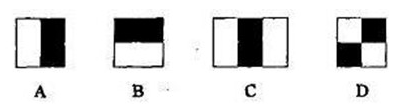

对于图中的A, B和D这类特征，特征数值计算公式为：v=Σ白-Σ黑，而对于C来说，计算公式如下：v=Σ白-2*Σ黑；之所以将黑色区域像素和乘以2，是为了使两种矩形区域中像素数目一致。我们希望当把矩形放到人脸区域计算出来的特征值和放到非人脸区域计算出来的特征值差别越大越好，这样就可以用来区分人脸和非人脸。

通过改变特征模板的大小和位置，可在图像子窗口中穷举出大量的特征。上图的特征模板称为“特征原型”；特征原型在图像子窗口中扩展（平移伸缩）得到的特征称为“矩形特征”；矩形特征的值称为“特征值”。

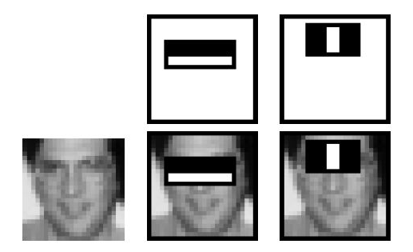

上图中两个矩形特征，表示出人脸的某些特征。比如中间一幅表示眼睛区域的颜色比脸颊区域的颜色深，右边一幅表示鼻梁两侧比鼻梁的颜色要深。同样，其他目标，如眼睛等，也可以用一些矩形特征来表示。使用特征比单纯地使用像素点具有很大的优越性，并且速度更快。

矩形特征可位于图像任意位置，大小也可以任意改变，所以矩形特征值是矩形模版类别、矩形位置和矩形大小这三个因素的函数。故类别、大小和位置的变化，使得很小的检测窗口含有非常多的矩形特征，如：在24*24像素大小的检测窗口内矩形特征数量可以达到16万个。这样就有两个问题需要解决了：

（1）如何快速计算那么多的特征？---积分图大显神通；

（2）哪些矩形特征才是对分类器分类最有效的？---如通过AdaBoost算法来训练。


###  **Haar-like特征的计算—积分图**

积分图就是只遍历一次图像就可以求出图像中所有区域像素和的快速算法，大大的提高了图像特征值计算的效率。

积分图主要的思想是将图像从起点开始到各个点所形成的矩形区域像素之和作为一个数组的元素保存在内存中，当要计算某个区域的像素和时可以直接索引数组的元素，不用重新计算这个区域的像素和，从而加快了计算（这有个相应的称呼，叫做动态规划算法）。积分图能够在多种尺度下，使用相同的时间（常数时间）来计算不同的特征，因此大大提高了检测速度。

积分图是一种能够描述全局信息的矩阵表示方法。积分图的构造方式是:位置（𝑖,𝑗）处的值𝑖𝑖(𝑖,𝑗)是原图像(𝑖,𝑗)左上角方向所有像素𝑓(𝑘,𝑙)的和：
$$
𝑖𝑖(𝑖,𝑗)=∑𝑘≤𝑖,𝑙≤𝑗𝑓(𝑘,𝑙)ii(i,j)=∑k≤i,l≤jf(k,l)
$$
积分图构建算法：

用𝑠(𝑖,𝑗)表示行方向的累加和，初始化𝑠(𝑖,−1)=0；

使用𝑖𝑖(𝑖,𝑗)表示一个积分图像，初始化𝑖𝑖(−1,𝑖)=0；

逐行扫描图像，递归计算每个像素(𝑖,𝑗)行方向的累加和𝑠(𝑖,𝑗)和积分图像𝑖𝑖(𝑖,𝑗)的值：
$$
𝑠(𝑖,𝑗)=𝑠(𝑖,𝑗−1)+𝑓(𝑖,𝑗)
$$

$$
𝑖𝑖(𝑖,𝑗)=𝑖𝑖(𝑖−1,𝑗)+𝑠(𝑖,𝑗)
$$

扫描图像一遍，当到达图像右下角像素时，积分图像𝑖𝑖就构建好了。

积分图构造好之后，图像中任何矩阵区域像素累加和都可以通过简单运算得到如图所示：

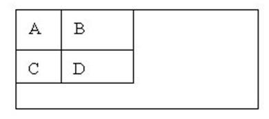

设D的四个顶点分别为α,β,γ,δ则D的像素和可以表示为
$$
𝐷𝑠𝑢𝑚=𝑖𝑖(α)+𝑖𝑖(β)−(𝑖𝑖(γ)+𝑖𝑖(δ))
$$
而Haar-like特征值无非就是两个矩阵像素和的差，同样可以在常数时间内完成。


###  计算Haar特征值

上面已经知道，一个区域的像素值的和，可以由该区域的端点的积分图来计算。由前面特征模板的特征值的定义可以推出，矩形特征的特征值可以由特征端点的积分图计算出来。以A矩形特征为例，如下图，使用积分图计算其特征值：

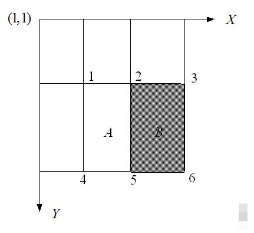

 

该矩形特征的特征值，由定义，为区域A的像素值减去区域B的像素值。

区域A的像素值：
$$
𝑖𝑖(5)+𝑖𝑖(1)−𝑖𝑖(2)−𝑖𝑖(4)
$$


区域B的像素值：
$$
𝑖𝑖(6)+𝑖𝑖(2)−𝑖𝑖(5)−𝑖𝑖(3)
$$


所以：该矩形特征的特征值
$$
𝑖𝑖(5)+𝑖𝑖(1)−𝑖𝑖(2)−𝑖𝑖(4)−[𝑖𝑖(6)+𝑖𝑖(2)−𝑖𝑖(5)−𝑖𝑖(3)]


=[𝑖𝑖(5)−𝑖𝑖(4)]+[𝑖𝑖(3)−𝑖𝑖(2)]−[𝑖𝑖(2)−𝑖𝑖(1)]−[𝑖𝑖(6)−𝑖𝑖(5)]
$$
所以，矩形特征的特征值，只与特征矩形的端点的积分图有关，而与图像的坐标无关。通过计算特征矩形的端点的积分图，再进行简单的加减运算，就可以得到特征值，正因为如此，特征的计算速度大大提高，也提高了目标的检测速度。

了解了特征值的计算之后，我们来看看不同的特征值的含义是什么。我们选取MIT人脸库中2706个大小为20*20的人脸正样本图像，计算如下图所示的Haar特征：

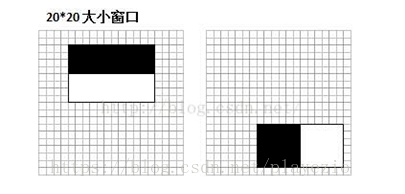

左边对应的人眼区域，右边无具体意义。

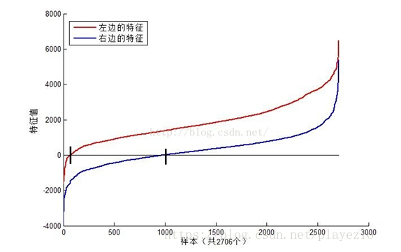

可以看到，图中2个不同Haar特征在同一组样本中具有不同的特征值分布，左边特征计算出的特征值基本都大于0（对样本的区分度大），而右边特征的特征值基本均匀分布于0两侧（对样本的区分度小）。所以，正是由于样本中Haar特征值分布不均匀，导致了不同Haar特征分类效果不同。显而易见，对正负样本区分度越大的特征分类效果越好，即红色曲线对应图中的的左边Haar特征分类效果好于右边Haar特征。

那么看到这里，应该理解了下面2个问题：

（1）在检测窗口通过平移+缩放可以产生一系列Haar特征，这些特征由于位置和大小不同，分类效果也不同；

（2）通过计算Haar特征的特征值，可以有将图像矩阵映射为1维特征值，有效实现了降维。


###  Haar特征值归一化(也可以采用标准归一化)

从上图我们可以发现，仅仅一个12*8大小的Haar特征计算出的特征值变化范围从-2000~+6000，跨度非常大。这种跨度大的特性不利于量化评定特征值，所以需要进行“归一化”，压缩特征值范围。假设当前检测窗口中的图像像素为𝑖(𝑥,𝑦)i(x,y)，当前检测窗口为𝑤∗ℎw∗h大小（例如上图中为20*20大小），OpenCV采用如下方式“归一化”：

计算检测窗口中图像的灰度值和灰度值平方和：
$$
sum=\sum i(x,y)
$$

$$
sq_{sum}=\sum i^2(x,y)
$$

 计算平均值：
$$
mean = \frac{sum}{w*h}
$$

$$
sq_{mean}=\frac{sq_{sum}}{w*h}
$$

计算归一化因子：
$$
varNormFactor=\sqrt{sq_{mean}-mean^2}
$$
归一化特征值：
$$
normValue=\frac{featureValue}{varNormFactor}
$$
之后使用归一化的特征值𝑛𝑜𝑟𝑚𝑉𝑎𝑙𝑢𝑒与阈值对比。


###  (可选) Adaboost级联分类器

前面几块内容我们分析了Haar特征，积分图、特征值计算。这里则主要分析一下2个内容：

（1）OpenCV中的Adaboost级联分类器的结构，包括强分类器和弱分类器的形式；

（2）OpenCV自带的XML分类器中各项参数，如internalNodes和leafValues标签里面的一大堆数字的意义。

#### 级联分类器

级联分类模型是树状结构可以用下图表示：

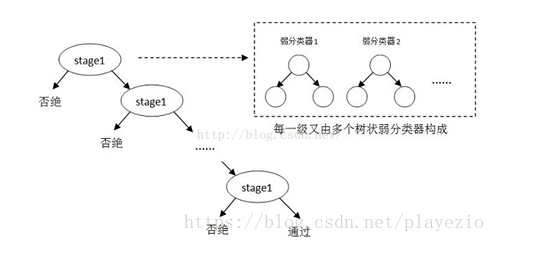

其中每一个stage都代表一级强分类器。当检测窗口通过所有的强分类器时才被认为是正样本，否则拒绝。实际上，不仅强分类器是树状结构，强分类器中的每一个弱分类器也是树状结构。由于每一个强分类器对负样本的判别准确度非常高，所以一旦发现检测到的目标位负样本，就不在继续调用下面的强分类器，减少了很多的检测时间。因为一幅图像中待检测的区域很多都是负样本，这样由级联分类器在分类器的初期就抛弃了很多负样本的复杂检测，所以级联分类器的速度是非常快的；只有正样本才会送到下一个强分类器进行再次检验，这样就保证了最后输出的正样本的伪正(false positive)的可能性非常低。

#### 级联分类器的训练

级联分类器是如何训练的呢？首先需要训练出每一个弱分类器，然后把每个弱分类器按照一定的组合策略，得到一个强分类器，我们训练出多个强分类器，然后按照级联的方式把它们组合在一块，就会得到我们最终想要的Haar分类器。

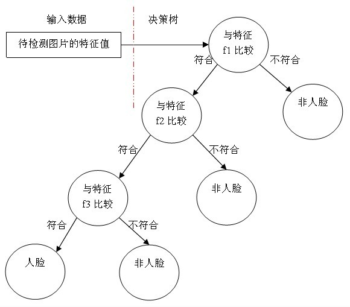

一个弱分类器就是一个基本和上图类似的决策树，最基本的弱分类器只包含一个Haar-like特征，也就是它的决策树只有一层，被称为树桩（stump）。

以20*20图像为例，78,460个特征，如果直接利用AdaBoost训练，那么工作量是极其极其巨大的。

所以必须有个筛选的过程，筛选出T个优秀的特征值（即最优弱分类器），然后把这个T个最优弱分类器传给AdaBoost进行训练。

现在有人脸样本2000张，非人脸样本4000张，这些样本都经过了归一化，大小都是20x20的图像。那么，对于78,460中的任一特征$f_i$，我们计算该特征在这2000人脸样本、4000非人脸样本上的值，这样就得到6000个特征值。将这些特征值排序，然后选取一个最佳的特征值，在该特征值下，对于特征$f_i$来说，样本的加权错误率最低。

在确定了训练子窗口中(20x20的图像)的矩形特征数量(78,460)和特征值后，需要对每一个特征$f$，训练一个弱分类器$ℎ(𝑥,𝑓,ρ,Θ)$ :
$$
h(x,f,ρ,Θ)=\begin{cases}1,   {ρf(x)<ρΘ}\\0,  {other}\end{cases}
$$


其中𝑓为特征，Θ为阈值，ρ指示不等号的方向，𝑥代表一个检测子窗口。对每个特征𝑓，训练一个弱分类器ℎ(𝑥,𝑓,ρ,Θ)，就是确定𝑓的最优阈值，使得这个弱分类器对所有的训练样本分类误差最低。

在弱分类器训练的过程中，训练采用的照片一般都是20*20左右的小图片，**弱分类器训练的具体步骤**：

对于每个特征 𝑓，计算所有训练样本的特征值，并将其排序：

扫描一遍排好序的特征值，对排好序的表中的每个元素，计算下面四个值：

计算全部正例的权重和𝑇+；

计算全部负例的权重和𝑇−；

计算该元素前之前的正例的权重和𝑆+；

计算该元素前之前的负例的权重和𝑆−；

选取当前元素的特征值$F_{k,j}$和它前面的一个特征值$F_{k,j-1}$之间的数作为阈值，所得到的弱分类器就在当前元素处把样本分开 —— 也就是说这个阈值对应的弱分类器将当前元素前的所有元素分为人脸（或非人脸），而把当前元素后（含）的所有元素分为非人脸（或人脸）。该阈值的分类误差为：
$$
e=min(S^++(T^--S^-),S^-+(T^+-S^+))
$$
于是，通过把这个排序表从头到尾扫描一遍就可以为弱分类器选择使分类误差最小的阈值（最优阈值），也就是选取了一个最佳弱分类器。

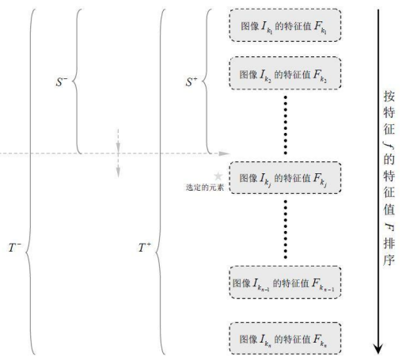

 

由于一共有78,460个特征、因此会得到78,460个最优弱分类器，在78,460个特征中，我们选取错误率最低的特征，用来判断人脸，同时用此分类器对样本进行分类，并更新样本的权重。

**强分类器的训练步骤：**

1.、给定训练样本集$\left(x_{i}, y_{i}\right), i=1,2,3, \ldots N$,共N个样本，$y_i$取值为0(负样本)或者1(正样本)；设人脸正样本的数量为$n_1$，负样本数量为$n_2$； T为训练的最大循环次数；

2.、初始化样本权重为$\frac{1}{n_1+n_2}$，即为训练样本的初始概率分布；

$for\  t=1,...T$:
①权重归一化
$$
ω_{t,i}=\frac{ω_{t,i}}{\sum\limits_{j-1}^{n}ω_{t,j}}
$$


②对每个(种)特征𝑓𝑗fj，训练一个弱分类器ℎ𝑗hj（如上），每个分类器只使用一种Haar特征进行训练。分类误差为：
$$
ε_j=\sum\limits_{i}ω_i|h_j(x_i)-y_i|
$$
③从②确定的弱分类器中，找出一个具有最小分类误差的弱分类器$h_t$;
④更新每个样本对应的权重:
$$
\omega_{t+1, i}=\omega_{t, i} \beta_{t}^{1-e_{i}}
$$


这里，如果样本$x_i$被正确分类，则$e_i=0$，否则$e_i=1$，而
$$
\beta_t=\frac{ε_t}{1-ε_t}
$$


最终形成的强分类器组成为：
$$
h(x)=\left\{\begin{array}{cc}
1 & \sum_{t-1}^{T} \alpha_{t} h_{t}(x) \geq 1 / 2 \sum_{t=1}^{T} \alpha_{t} \\
0 & \text { otherwise }
\end{array}\right.
$$
其中：
$$
\alpha_t=log\frac{1}{\beta_t}
$$

在使用Adaboost算法训练分类器之前，需要准备好正、负样本，根据样本特点选择和构造特征集。由算法的训练过程可知，当弱分类器对样本分类正确，样本的权重会减小；而分类错误时，样本的权重会增加。这样，后面的分类器会加强对错分样本的训练。最后，组合所有的弱分类器形成强分类器，通过比较这些弱分类器投票的加权和与平均投票结果来检测图像。

####  级联分类器的检测

训练级联分类器的目的就是为了检测的时候，更加准确，这涉及到Haar分类器的另一个体系，检测体系，检测体系是以现实中的一幅大图片作为输入，然后对图片中进行多区域，多尺度的检测，所谓多区域，是要对图片划分多块，对每个块进行检测，由于训练的时候用的照片一般都是20*20左右的小图片，所以对于大的人脸，还需要进行多尺度的检测，多尺度检测机制一般有两种策略：

- 一种是不改变搜索窗口的大小，而不断缩放图片，这种方法显然需要对每个缩放后的图片进行区域特征值的运算，效率不高；
- 另一种方法，不断扩大搜索窗口，进行搜索，解决了第一种方法的弱势。

在区域放大的过程中会出现同一个人脸被多次检测，这需要进行区域的合并，这里不作探讨。

无论哪一种搜索方法，都会为输入图片输出大量的子窗口图像，这些子窗口图像经过筛选式级联分类器会不断地被每一个节点筛选，抛弃或通过。

####  总结

从上面所述内容我们可以总结Haar分类器训练的五大步骤：

准备人脸、非人脸样本集；

计算特征值和积分图；

筛选出T个优秀的特征值（即最优弱分类器）；

把这个T个最优弱分类器传给AdaBoost进行训练。

级联，也就是强分类器的强强联手。

在开始前，一定要记住，以20*20窗口为例，就有78,460的特征数量，筛选出T个优秀的特征值（即最优弱分类器），然后把这个T个最优弱分类器传给AdaBoost进行训练得到一个强分类器，最后将强分类器进行级联。

#### XML文件

OpenCV 自带了训练器和检测器。如果你想自己训练一个分类器来检测汽车，飞机等的话，可以使用 OpenCV 构建。其中的细节参考这里：[Cascade ](http://docs.opencv.org/2.4/doc/user_guide/ug_traincascade.html)[Classifier Training](http://docs.opencv.org/2.4/doc/user_guide/ug_traincascade.html)。这里我们介绍的XML文件，就是OpenCV自带的检测器。使用python pip安装最新的`opencv-python`包：

```bash
 pip install opencv-python
```

查看包的位置

```bash
pip show opencv-python
```

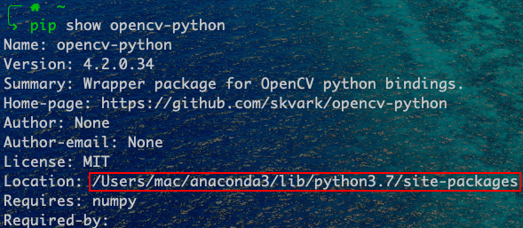

进入红框的文件夹

```bash
cd /Users/mac/anaconda3/lib/python3.7/site-packages #根据自己的情况选择
```

进入这个文件夹下的cv2目录

```bash
cd cv2
```

XML文件就在`data/`文件夹下

在笔者电脑操作如下：

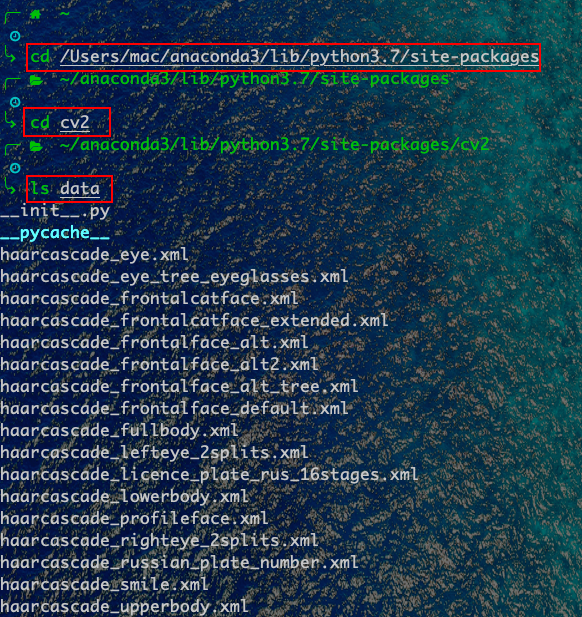

从这些文件名可以知道这些级联适用于检测人脸、眼睛、鼻子和嘴等部位的跟踪，这些文件需要正面、直立的人体图像。

 xml文件主要保存相关的特征矩阵，以及各个弱分类器相关的信息，关于各个节点的具体含义可以参考文章[haar+adaboost结合讲解（偏重实际）](https://blog.csdn.net/playezio/article/details/80471000)，这里不做过多的介绍。

##  实战   

### 例程

我们首先把上述的`data`文件夹复制到当前项目路径下，然后创建.py文件，例程如下：

```python
import cv2
import numpy as np

haar_front_face_xml = './data/haarcascade_frontalface_default.xml'
haar_eye_xml = './data/haarcascade_eye.xml'


# 1.静态图像中的人脸检测
def StaticDetect(filename):
    # 创建一个级联分类器 加载一个 .xml 分类器文件. 它既可以是Haar特征也可以是LBP特征的分类器.
    face_cascade = cv2.CascadeClassifier(haar_front_face_xml)

    # 加载图像
    img = cv2.imread(filename)
    # 转换为灰度图
    gray_img = cv2.cvtColor(img, cv2.COLOR_BGR2GRAY)
    # 进行人脸检测，传入scaleFactor，minNegihbors，分别表示人脸检测过程中每次迭代时图像的压缩率以及
    # 每个人脸矩形保留近似数目的最小值
    # 返回人脸矩形数组
    faces = face_cascade.detectMultiScale(gray_img, 1.3, 5)
    for (x, y, w, h) in faces:
        # 在原图像上绘制矩形
        img = cv2.rectangle(img, (x, y), (x + w, y + h), (255, 0, 0), 2)
    cv2.namedWindow('Face Detected！')
    cv2.imshow('Face Detected！', img)
    cv2.waitKey(0)
    cv2.destroyAllWindows()


# 视频中的人脸检测
def DynamicDetect():
    '''
    打开摄像头，读取帧，检测帧中的人脸，扫描检测到的人脸中的眼睛，对人脸绘制蓝色的矩形框，对人眼绘制绿色的矩形框
    '''
    # 创建一个级联分类器 加载一个 .xml 分类器文件. 它既可以是Haar特征也可以是LBP特征的分类器.
    face_cascade = cv2.CascadeClassifier(haar_front_face_xml)
    eye_cascade = cv2.CascadeClassifier(haar_eye_xml)

    # 打开摄像头
    camera = cv2.VideoCapture(0)
    cv2.namedWindow('Dynamic')

    while True:
        # 读取一帧图像
        ret, frame = camera.read()
        # 判断图片读取成功？
        if ret:
            gray_img = cv2.cvtColor(frame, cv2.COLOR_BGR2GRAY)
            # 人脸检测
            faces = face_cascade.detectMultiScale(gray_img, 1.3, 5)
            for (x, y, w, h) in faces:
                # 在原图像上绘制矩形
                cv2.rectangle(frame, (x, y), (x + w, y + h), (255, 0, 0), 2)
                roi_gray = gray_img[y:y + h, x:x + w]
                # 眼睛检测
                eyes = eye_cascade.detectMultiScale(roi_gray, 1.03, 5, 0, (40, 40))
                for (ex, ey, ew, eh) in eyes:
                    cv2.rectangle(frame, (ex + x, ey + y), (x + ex + ew, y + ey + eh), (0, 255, 0), 2)

            cv2.imshow('Dynamic', frame)
            # 如果按下q键则退出
            if cv2.waitKey(100) & 0xff == ord('q'):
                break

    camera.release()
    cv2.destroyAllWindows()


if __name__ == '__main__':
    filename = 'test1.jpg'
    StaticDetect(filename)
    # DynamicDetect()
```


###  静态图像中的人脸检测

我们来分析一下StaticDetect函数，首先创建一个级联分类器对象，然后加载xml检测器，用来进行人脸检测。

```python
    #创建一个级联分类器 加载一个 .xml 分类器文件. 它既可以是Haar特征也可以是LBP特征的分类器.
    face_cascade = cv2.CascadeClassifier(haar_front_face_xml)
```

然后加载图片文件，并将其转换为灰度图像，因为人脸检测需要这样的色彩空间。

```python
    #加载图像
    img = cv2.imread(filename)
    #转换为灰度图
    gray_img = cv2.cvtColor(img,cv2.COLOR_BGR2GRAY)
```

接下来进行人脸检测，需要传入scaleFactor和minNeighbors参数，它们分别表示人脸检测过程中每次迭代时图像的压缩率以及每个人脸矩形保留近似数目的最小值。然后函数返回人脸矩阵数组。我们利用cv2.rectangle函数在原图中把矩形绘制出来。

[](javascript:void(0);)

```python
    #进行人脸检测，传入scaleFactor，minNegihbors，分别表示人脸检测过程中每次迭代时图像的压缩率以及
    #每个人脸矩形保留近似数目的最小值
    #返回人脸矩形数组
    faces = face_cascade.detectMultiScale(gray_img,1.3,5)
    for (x,y,w,h) in faces:
        #在原图像上绘制矩形
        img = cv2.rectangle(img,(x,y),(x+w,y+h),(255,0,0),2)
    cv2.namedWindow('Face Detected！')
    cv2.imshow('Face Detected！',img)
    cv2.waitKey(0)
    cv2.destroyAllWindows()
```

[](javascript:void(0);)

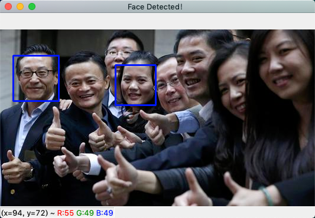

只有两个被检测出来，可能测试图片偏难，人脸图片并没有全检测出来，大家可以换不同图片试试。

### 通过摄像头进行人脸和眼睛检测

上面已经介绍了在静态图像上进行人脸检测，在视频帧上重复进行这个过程就能完成视频中的人脸检测。`DynamicDetect`函数主要包括：打开摄像头、读取帧、检测人脸、扫描检测到的人脸中的眼睛，并使用不同颜色绘制出矩形框。

这里和上面有些类似，只是在进行眼睛检测的时候多了几个参数。detectMultiScale有许多可选参数；在人脸检测时，默认选项足以检测人脸，但是眼睛是一个比较小的人脸特征，并且胡子或者鼻子的本身阴影以及帧的随机阴影都会产生假阳性。通过限制对眼睛搜索的最小尺寸为40x40像素，可以去掉假阳性。然后测试这些参数，直至应用程序可以满足预期(例如可以尝试指定特征的最大尺寸，或增加比例因子以及近邻的数量)。

下面我们来总结一下detectMultiScale函数：

```python
detectMultiScale(image[,scaleFactor[,minNeighbors[,flags[,minSize[,maxSize]]]]])
```

- image：表示的是要检测的输入图像
- scaleFactor：为每一个图像尺度中的尺度参数，默认值为1.1。scaleFactor参数可以决定两个不同大小的窗口扫描之间有多大的跳跃，这个参数设置的大，则意味着计算会变快，但如果窗口错过了某个大小的人脸，则可能丢失物体。
- minNeighbors：参数为每一个级联矩形应该保留的邻近个数，默认为3。minNeighbors控制着误检测，默认值为3表明至少有3次重叠检测，我们才认为人脸确实存。
- flags：对于新的分类器没有用（但目前的haar分类器都是旧版的，CV_HAAR_DO_CANNY_PRUNING,这个值告诉分类器跳过平滑（无边缘区域）。利用Canny边缘检测器来排除一些边缘很少或者很多的图像区域；CV_HAAR_SCALE_IMAGE，这个值告诉分类器不要缩放分类器。而是缩放图像（处理好内存和缓存的使用问题，这可以提高性能。）就是按比例正常检测；CV_HAAR_FIND_BIGGEST_OBJECTS，告诉分类器只返回最大的目标（这样返回的物体个数只可能是0或1）只检测最大的物，CV_HAAR_DO_ROUGH_SEARCH，他只可与CV_HAAR_FIND_BIGGEST_OBJECTS一起使用，这个标志告诉分类器在任何窗口，只要第一个候选者被发现则结束寻找（当然需要足够的相邻的区域来说明真正找到了。）,只做初略检测.
- minSize：为目标的最小尺寸
- maxSize：为目标的最大尺寸


## 相关技术文档、论文推荐
*       [主要参考：人脸检测之Haar分类器](https://www.cnblogs.com/zyly/p/9410563.html)
*       [集成学习值Adaboost算法原理和代码小结](https://www.cnblogs.com/zyly/p/9416263.html)
*       [官方教学——使用Haar特征进行人脸检测](https://opencv-python-tutroals.readthedocs.io/en/latest/py_tutorials/py_objdetect/py_face_detection/py_face_detection.html?highlight=detectmultiscale)
---
**Task03 Haar特征描述算子-人脸检测.**

--- ***By: QiangZiBro***


>[Github](https://github.com/QiangZiBro)

**关于Datawhale**：

>Datawhale是一个专注于数据科学与AI领域的开源组织，汇集了众多领域院校和知名企业的优秀学习者，聚合了一群有开源精神和探索精神的团队成员。Datawhale以“for the learner，和学习者一起成长”为愿景，鼓励真实地展现自我、开放包容、互信互助、敢于试错和勇于担当。同时Datawhale 用开源的理念去探索开源内容、开源学习和开源方案，赋能人才培养，助力人才成长，建立起人与人，人与知识，人与企业和人与未来的联结。


<div STYLE="page-break-after: always;"></div>
# Datawhale 计算机视觉基础-图像处理（下）-Task04 HOG特征描述算子-行人检测

##  简介 
本次任务将学习一种在深度学习之前非常流行的图像特征提取技术——方向梯度直方图（Histogram of Oriented Gradients），简称HOG特征。HOG特征是在2005年CVPR的会议发表，在图像手工特征提取方面具有里程碑式的意义，当时在行人检测领域获得了极大成功。                     

学习HOG特征的思想也有助于我们很好地了解传统图像特征描述和图像识别方法，本次任务我们将学习到HOG背后的设计原理，和opencv的实现。                    

##  学习目标

 -  理解HOG特征的原理和思想      
 -  使用OpenCV的HOG算法实现行人检测      

##  内容大纲
 - HOG特征简介       
 - HOG特征的原理            
      - 图像预处理           
      - 计算图像梯度              
      - 计算梯度直方图         
      - Block归一化                     
      - 获得HOG描述子                          
  - 基于OpenCV实现        
                     
##  内容介绍              
                       
### HOG特征简介                     
                     
                   
                     
HOG特征是一种图像局部特征，其基本思路是对图像局部的**梯度幅值和方向**进行投票统计，形成基于梯度特性的直方图，然后将局部特征拼接起来作为总特征。局部特征在这里指的是将图像划分为多个子块（Block), 每个Block内的特征进行联合以形成最终的特征。                                                                
       
HOG+SVM的工作流程如下：             
                       
                            
                                 
首先对输入的图片进行预处理，然后计算像素点的梯度特特性，包括梯度幅值和梯度方向。然后投票统计形成梯度直方图，然后对blocks进行normalize，最后收集到HOG feature（其实是一行多维的vector）放到SVM里进行监督学习，从而实现行人的检测。下面我们将对上述HOG的主要步骤进行学习。                     
                        
### HOG特征的原理                 
                        
### 图像预处理                       
                              
预处理包括灰度化和Gamma变换。                          
               
灰度处理是可选操作，因为灰度图像和彩色图像都可以用于计算梯度图。对于彩色图像，先对三通道颜色值分别计算梯度，然后取梯度值最大的那个作为该像素的梯度。                  
             
然后进行伽马矫正，调节图像对比度，减少光照对图像的影响（包括光照不均和局部阴影），使过曝或者欠曝的图像恢复正常，更接近人眼看到的图像。                                     
                             
 伽马矫正公式：                                   
                                                                               
   **$f(I)=I^\gamma$**                                        
                                                                                       
  $I$表示图像，$\gamma$表示幂指数。                            
                                                                  
如图，当$\gamma$取不同的值时对应的输入输出曲线( $\gamma=1$时输入输出保持一致) ：                                                                     
1）  当$\gamma<1$时，输入图像的低灰度值区域动态范围变大，进而图像低灰度值区域对比度得以增强；在高灰度值区域，动态范围变小，进而图像高灰度值区域对比度得以降低。  最终，图像整体的灰度变亮。                            
                              
2） 当$\gamma>1$时，输入图像的高灰度值区域动态范围变小，进而图像低灰度值区域对比度得以降低；在高灰度值区域，动态范围变大，进而图像高灰度值区域对比度得以增强。  最终，图像整体的灰度变暗。        
                             
           
                             

代码：                             
                
```python
import cv2
import numpy as np
from matplotlib import pyplot as plt
img = cv2.imread('*.png', 0)
img = cv2.cvtColor(img,cv2.COLOR_BGR2RGB)
img2 = np.power(img/float(np.max(img)),1/2.2)
plt.imshow(img2)
plt.axis('off')
plt.show()
```                    
                       
                      
## 计算图像梯度              
       
为了得到梯度直方图，那么首先需要计算图像水平方向和垂直方向梯度。                    
一般使用特定的卷积核对图像滤波实现，可选用的卷积模板有：soble算子、Prewitt算子、Roberts模板等等。           
                                                              
 一般采用soble算子，OpenCV也是如此，利用soble水平和垂直算子与输入图像卷积计算$dx$、$dy$： 
                                                 
    
                                                                                               

                      
                             
                                                                
                     
                                                            
                                   
                                             
 进一步可以得到图像梯度的幅值：                    
                   
          
                
 为了简化计算，幅值也可以作如下近似：                   
                               
 
                      
角度为：            

                 
           
这里需要注意的是：梯度方向和图像边缘方向是互相正交的。                    
          
              
                                            
代码：            
                      
```python
mport cv2
import numpy as np
​
# Read image
img = cv2.imread('*.jpg')
img = np.float32(img) / 255.0  # 归一化
​
# 计算x和y方向的梯度
gx = cv2.Sobel(img, cv2.CV_32F, 1, 0, ksize=1)
gy = cv2.Sobel(img, cv2.CV_32F, 0, 1, ksize=1)
​
# 计算合梯度的幅值和方向（角度）
mag, angle = cv2.cartToPolar(gx, gy, angleInDegrees=True)
```                   
                
## 计算梯度直方图             
                          
经过上一步计算，每一个像素点都会有两个值：梯度幅值/梯度方向。             

在这一步中，图像被分成若干个8×8的cell，例如我们将图像resize至64x128的大小，那么这幅图像就被划分为8x16个8x8的cell单元，并为每个8×8的cell计算梯度直方图。当然，cell的划分也可以是其他值：16x16，8x16等，根据具体的场景确定。                      

在计算梯度直方图，让我们先了解一下为什么我们将图像分成若干个cell?             
      
这是因为如果对一整张梯度图逐像素计算，其中的有效特征是非常稀疏的，不但运算量大，而且会受到一些噪声干扰。于是我们就使用局部特征描述符来表示一个更紧凑的特征，计算这种局部cell上的梯度直方图更具鲁棒性。                
                 
以8x8的cell为例，一个8x8的cell包含了8x8x2 = 128个值，因为每个像素包括梯度的大小和方向。                   
   
在HOG中，每个8x8的cell的梯度直方图本质是一个由9个数值组成的向量， 对应于2460…160的梯度方向(角度)。那么原本cell中8x8x2 = 128个值就由长度为9的向量来表示，用这种梯度直方图的表示方法，大大降低了计算量，同时又对光照等环境变化更加地鲁棒。                                  
      
首先，看下图：        
                 
                 
           
左图是衣服64x128的图像，被划分为8x16个8x8的cell；中间的图像表示一个cell中的梯度矢量，箭头朝向代表梯度方向，箭头长度代表梯度大小。                            
      
右图是 8×8 的cell中表示梯度的原始数值，注意角度的范围介于0到180度之间，而不是0到360度， 这被称为“无符号”梯度，因为两个完全相反的方向被认为是相同的。                                  
      
 接下来，我们来计算cell中像素的梯度直方图，将0-180度分成9等份，称为9个bins，分别是0，20，40...160。然后对每个bin中梯度的贡献进行统计：       
               
                           
          
统计方法是一种加权投票统计，  如上图所示，某像素的梯度幅值为13.6，方向为36，36度两侧的角度bin分别为20度和40度，那么就按一定加权比例分别在20度和40度对应的bin加上梯度值，加权公式为：                                     
                                  
20度对应的bin：(（40-36）/20) * 13.6，分母的20表示20等份，而不是20度；                      
40度对应的bin：(（36-20）/20) * 13.6，分母的20表示20等份，而不是20度；           
          

还有一个细节需要注意，如果某个像素的梯度角度大于160度，也就是在160度到180度之间，那么把这个像素对应的梯度值按比例分给0度和160度对应的bin。如左下图绿色圆圈中的角度为165度，幅值为85，则按照同样的加权方式将85分别加到0度和160度对应的bin中。                                              
                
                        
                                  
对整个cell进行投票统计，正是在HOG特征描述子中创建直方图的方式，最终得到由9个数值组成的向量—梯度方向图：      
             
                      
        
### Block 归一化             
                       
HOG特征将8×8的一个局部区域作为一个cell，再以2×2个cell作为一组，称为一个block，也就是说一个block表示16x16的区域。                               
   
我们可能会想，为什么又需要分block呢？                   
        
这是因为，虽然我们已经为图像的8×8单元创建了HOG特征，但是图像的梯度对整体光照很敏感。这意味着对于特定的图像，图像的某些部分与其他部分相比会非常明亮。                      

我们不能从图像中完全消除这个。但是我们可以通过使用16×16个块来对梯度进行归一化来减少这种光照变化。           
                             
由于每个cell有9个值，一个block（2×2个cell）则有36个值，HOG是通过滑动窗口的方式来得到block的，如下图所示：                          
       
       
 前面已经说明，归一化的目的是为了降低光照的影响，因为梯度对整体光照非常敏感，比如通过将所有像素值除以2来使图像变暗，那么梯度幅值将减小一半，因此直方图中的值也将减小一半，我们就需要将直方图“归一化”。
     
 归一化的方法有很多：L1-norm、L2-norm、max/min等等，一般选择L2-norm。                       
              
 例如对于一个[128，64，32]的三维向量来说，模长是$\sqrt{128^2+64^2+32^2}=146.64$，这叫做向量的L2范数。将这个向量的每个元素除以146.64就得到了归一化向量 [0.87, 0.43, 0.22]。                 
    
 采用同样的方法，一个cell有一个梯度方向直方图，包含9个数值，一个block有4个cell，那么一个block就有4个梯度方向直方图，将这4个直方图拼接成长度为36的向量，然后对这个向量进行归一化。                    

而每一个block将按照上图滑动的方式进行重复计算，直到整个图像的block都计算完成。                
        
 ## 获得HOG描述子                           
                                      
 每一个16 * 16大小的block将会得到一个长度为36的特征向量，并进行归一化。 那会得到多少个特征向量呢？       
        
例如，对于上图被划分8 * 16个cell ，每个block有2x2个cell的话，那么cell的个数为：(16-1)x(8-1)=105。即有7个水平block和15个竖直block。                                              
      
每个block有36个值，整合所有block的特征值，最终获得由36 * 105=3780个特征值组成的特征描述符，而这个特征描述符是一个一维的向量，长度为3780。                           
     
获得HOG特征向量，就可以用来可视化和分类了。对于多维的HOG特征，SVM就可以排上用场了。                         
                                                  

##  基于OpenCV的实现              
                           
### 代码                  

```python
import cv2 as cv
import numpy as np
from matplotlib import pyplot as plt

if __name__ == '__main__':
    src = cv.imread("*.jpg")
    cv.imshow("input", src)
    
    hog = cv.HOGDescriptor()
    hog.setSVMDetector(cv.HOGDescriptor_getDefaultPeopleDetector())
    # Detect people in the image
    (rects, weights) = hog.detectMultiScale(src,
                                            winStride=(2,4),
                                            padding=(8, 8),
                                            scale=1.2,
                                            useMeanshiftGrouping=False)
    for (x, y, w, h) in rects:
        cv.rectangle(src, (x, y), (x + w, y + h), (0, 255, 0), 2)

    cv.imshow("hog-detector", src)
    cv.imwrite("hog-detector.jpg",src)
    cv.waitKey(0)
    cv.destroyAllWindows()
```                 
                    
原图显示如下：                        
                                                        
                   
              
 结果显示如下：                                     
                                      
                       
        
### 可视化：                                   
                          
```python
from skimage import feature, exposure
from matplotlib import pyplot as plt
import cv2
image = cv2.imread('sp_g.jpg')
image = cv2.cvtColor(image, cv2.COLOR_BGR2GRAY)

fd, hog_image = feature.hog(image, orientations=9, pixels_per_cell=(8, 8),
                    cells_per_block=(2, 4), visualise=True)

# Rescale histogram for better display
hog_image_rescaled = exposure.rescale_intensity(hog_image, in_range=(0, 10))

cv2.namedWindow("img",cv2.WINDOW_NORMAL)
cv2.imshow('img', image)
cv2.namedWindow("hog",cv2.WINDOW_NORMAL)
cv2.imshow('hog', hog_image_rescaled)
cv2.waitKey(0)==ord('q')
```               
   
可视化结果：                                      
                    
    
                          
##  总结                
HOG算法具有以下优点：                            

 - HOG描述的是边缘结构特征，可以描述物体的结构信息                
 - 对光照影响不敏感                   
 - 分块的处理可以使特征得到更为紧凑的表示               
      
HOG算法具有以下缺点：                 
 - 特征描述子获取过程复杂，维数较高，导致实时性差                
 - 遮挡问题很难处理                    
 - 对噪声比较敏感                     
     
                      
## 相关技术文档、论文推荐            
* [Histograms of Oriented Gradients for Human Detection - 2005CVPR](https://hal.inria.fr/file/index/docid/548512/filename/hog_cvpr2005.pdf)               
* [HOG特征详解与行人检测](https://cloud.tencent.com/developer/article/1419615)           
* [Histogram of Oriented Gradients](https://www.learnopencv.com/histogram-of-oriented-gradients/)    
* [一文讲解方向梯度直方图（hog）](https://zhuanlan.zhihu.com/p/85829145)     
           
---
    
**Task04  HOG特征 END.**

--- ***By: 小武***


>博客：[https://blog.csdn.net/weixin_40647819](https://blog.csdn.net/weixin_40647819)


**关于Datawhale**：

>Datawhale是一个专注于数据科学与AI领域的开源组织，汇集了众多领域院校和知名企业的优秀学习者，聚合了一群有开源精神和探索精神的团队成员。Datawhale以“for the learner，和学习者一起成长”为愿景，鼓励真实地展现自我、开放包容、互信互助、敢于试错和勇于担当。同时Datawhale 用开源的理念去探索开源内容、开源学习和开源方案，赋能人才培养，助力人才成长，建立起人与人，人与知识，人与企业和人与未来的联结。


###### <br><br><br><br><br><br><br><br><br><br><br>
