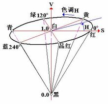

###### <sup>Datawhale</sup><br>数字图像处理教程<br>────────<br><br>`# 版本丨V1.0 #`<br><br><br>**王程伟 任乔牧 李芝翔 张强**<br><br><div align=center></div><br><br>*Github Datawhalechina*<br>*http://www.datawhale.club*<br>
[TOC]
<div STYLE="page-break-after: always;"></div>
# Datawhale 计算机视觉基础-图像处理-Task01 OpenCV框架与图像插值算法

## 简介 
&emsp;&emsp;在图像处理中，平移变换、旋转变换以及放缩变换是一些基础且常用的操作。这些几何变换并不改变图象的象素值，只是在图象平面上进行象素的重新排列。在一幅输入图象$[u，v]$中，灰度值仅在整数位置上有定义。然而，输出图象[x，y]的灰度值一般由处在非整数坐标上的$（u，v）$值来决定。这就需要插值算法来进行处理，常见的插值算法有最近邻插值、双线性插值和三次样条插值。

## 学习目标

- 了解插值算法与常见几何变换之间的关系
- 理解插值算法的原理
- 掌握OpenCV框架下插值算法API的使用

## 内容介绍

1. 插值算法原理介绍
   - 最近邻插值算法
   - 双线性插值算法
2. OpenCV代码实践
   - cv.resize()各项参数及含义
3. 动手实现（由读者自己完成）

## 算法理论介绍与推荐

### 最近邻插值算法原理

&emsp;&emsp;最近邻插值，是指将目标图像中的点，对应到源图像中后，找到最相邻的整数点，作为插值后的输出。


&emsp;&emsp;如上图所示，目标图像中的某点投影到原图像中的位置为点P,此时易知，$f(P) = f(Q11)$.

**一个例子：**

&emsp;&emsp;如下图所示，将一幅3X3的图像放大到4X4，用$f(x, y)$表示目标图像，$h(x, y)$表示原图像，我们有如下公式：

$$
\begin{array}{c}
f(dst_{X}, dst_{Y}) = h(\frac{dst_{X}src_{Width}}  {dst_{Width}}, \frac{dst_{Y}src_{Height}} {dst_{Height}})
\end{array}
$$

$$
\begin{array}{c}
f(0,0)=h(0,0) \\
f(0,1)=h(0,0.75)=h(0,1) \\
f(0,2)=h(0,1.50)=h(0,2) \\
f(0,3)=h(0,2.25)=h(0,2) \\
...\\
\end{array}
$$


**缺点：**
用该方法作放大处理时，在图象中可能出现明显的块状效应


### 双线性插值

&emsp;&emsp;在讲双线性插值之前先看以一下线性插值，线性插值多项式为：

$$
f(x)=a_{1} x+a_{0}
$$


$$y=y_{0}+\left(x-x_{0}\right) \frac{y_{1}-y_{0}}{x_{1}-x_{0}}=y_{0}+\frac{\left(x-x_{0}\right) y_{1}-\left(x-x_{0}\right) y_{0}}{x_{1}-x_{0}}$$

&emsp;&emsp;双线性插值就是线性插值在二维时的推广,在两个方向上做三次线性插值，具体操作如下图所示：


&emsp;&emsp;令$f(x，y)$为两个变量的函数，其在单位正方形顶点的值已知。假设我们希望通过插值得到正方形内任意点的函数值。则可由双线性方程:
$$f(x, y)=a x+b y+c x y+d$$

&emsp;&emsp;来定义的一个双曲抛物面与四个已知点拟合。

&emsp;&emsp;首先对上端的两个顶点进行线性插值得：

$$f(x, 0)=f(0,0)+x[f(1,0)-f(0,0)]$$

&emsp;&emsp;类似地，再对底端的两个顶点进行线性插值有：
$$f(x, 1)=f(0,1)+x[f(1,1)-f(0,1)]$$

&emsp;&emsp;最后，做垂直方向的线性插值，以确定：

$$f(x, y)=f(x, 0)+y[f(x, 1)-f(x, 0)]$$

&emsp;&emsp;整理得：

$$\begin{array}{l}
f(x, y)=[f(1,0)-f(0,0)] x+[f(0,1)-f(0,0)] y \\
+[f(1,1)+f(0,0)-f(0,1)-f(1,0)] x y+f(0,0)
\end{array}$$


### 映射方法

**向前映射法**
		
&emsp;&emsp;可以将几何运算想象成一次一个象素地转移到输出图象中。如果一个输入象素被映射到四个输出象素之间的位置，则其灰度值就按插值算法在4个输出象素之间进行分配。称为向前映射法，或象素移交影射。

>注：从原图象坐标计算出目标图象坐标镜像、平移变换使用这种计算方法


**向后映射法**
		
&emsp;&emsp;向后映射法（或象素填充算法）是输出象素一次一个地映射回到输入象素中，以便确定其灰度级。如果一个输出象素被映射到4个输入象素之间，则其灰度值插值决定，向后空间变换是向前变换的逆。
>注：从结果图象的坐标计算原图象的坐标

- 旋转、拉伸、放缩可以使用
- 解决了漏点的问题，出现了马赛克


## 基于OpenCV的实现

### C++

**函数原型：**

>void cv::resize(InputArray src, OutputArray dst, Size dsize, double fx=0, double fy=0, int interpolation=INTER_LINEAR )

    src:输入图像
    dst:输出图像
    dsize:输出图像尺寸
    fx、fy:x,y方向上的缩放因子
    INTER_LINEAR：插值方法，总共五种
        1. INTER_NEAREST - 最近邻插值法
        2. INTER_LINEAR - 双线性插值法（默认）
        3. INTER_AREA - 基于局部像素的重采样(resampling using pixel area relation)。对于图像抽取(image decimation)来说，这可能是一个更好的方法。但如果是放大图像时，它和最近邻法的效果类似。
        4. INTER_CUBIC - 基于4x4像素邻域的3次插值法
        5. INTER_LANCZOS4 - 基于8x8像素邻域的Lanczos插值


**代码实践：**
```cpp
#include <opencv2/opencv.hpp>
#include <iostream>

using namespace cv;
using namespace std;

int main(int argc, char* argv[])
{
	Mat img = imread("D:/image/yuner.jpg");
	if (img.empty())
	{
		cout << "无法读取图像" << endl;
		return 0;
	}

	int height = img.rows;
	int width = img.cols;
	// 缩小图像，比例为(0.2, 0.2)
	Size dsize = Size(round(0.2 * width), round(0.2 * height));
	Mat shrink;
    //使用双线性插值
	resize(img, shrink, dsize, 0, 0, INTER_LINEAR);

	// 在缩小图像的基础上，放大图像，比例为(1.5, 1.5)
	float fx = 1.5;
	float fy = 1.5;
	Mat enlarge1, enlarge2;
	resize(shrink, enlarge1, Size(), fx, fy, INTER_NEAREST);
	resize(shrink, enlarge2, Size(), fx, fy, INTER_LINEAR);

	// 显示
	imshow("src", img);
	imshow("shrink", shrink);
	imshow("INTER_NEAREST", enlarge1);
	imshow("INTER_LINEAR", enlarge2);
	waitKey(0);
    return 0;
}
```
**原图**


**0.2倍缩小，双线性插值**


**1.5倍放大，最近邻插值**


**1.5倍放大，双线性插值**


### Python

**函数原型：**
>cv2.resize(src, dsize[, dst[, fx[, fy[, interpolation]]]])

**参数：**

| 参数 | 描述 |
|--|--|
| src | 【必需】原图像 |
| dsize | 【必需】输出图像所需大小 |
| fx | 【可选】沿水平轴的比例因子 |
| fy | 【可选】沿垂直轴的比例因子 |
| interpolation   | 【可选】插值方式 |

**插值方式：**
|  |  |
|--|--|
| cv.INTER_NEAREST | 最近邻插值 |
| cv.INTER_LINEAR | 双线性插值 |
| cv.INTER_CUBIC | 基于4x4像素邻域的3次插值法 |
| cv.INTER_AREA | 基于局部像素的重采样 |

>通常，缩小使用cv.INTER_AREA，放缩使用cv.INTER_CUBIC(较慢)和cv.INTER_LINEAR(较快效果也不错)。默认情况下，所有的放缩都使用cv.INTER_LINEAR。

**代码实践：**
```python
import cv2
 
if __name__ == "__main__":
    img = cv2.imread('D:/image/yuner.jpg', cv2.IMREAD_UNCHANGED)
    
    print('Original Dimensions : ',img.shape)
    
    scale_percent = 30       # percent of original size
    width = int(img.shape[1] * scale_percent / 100)
    height = int(img.shape[0] * scale_percent / 100)
    dim = (width, height)
    # resize image
    resized = cv2.resize(img, dim, interpolation = cv2.INTER_LINEAR)

    fx = 1.5
    fy = 1.5

    resized1 = cv2.resize(resized, dsize=None, fx=fx, fy=fy, interpolation = cv2.INTER_NEAREST)
    
    resized2 = cv2.resize(resized, dsize=None, fx=fx, fy=fy, interpolation = cv2.INTER_LINEAR)
    print('Resized Dimensions : ',resized.shape)
    
    cv2.imshow("Resized image", resized)
    cv2.imshow("INTER_NEAREST image", resized1)
    cv2.imshow("INTER_LINEAR image", resized2)
    cv2.waitKey(0)
    cv2.destroyAllWindows()
```
**0.3倍缩小，双线性插值**


**1.5倍放大，最近邻插值**


**1.5倍放大，双线性插值**


- 推荐书籍：学习OpenCV中文版
- 推荐博客：https://blog.csdn.net/hongbin_xu/category_6936122.html
  


  
## 总结 

 &emsp;&emsp;插值算法是很多几何变换的基础和前置条件，对插值算法细节的掌握有助于对其他算法的理解，为自己的学习打下坚实的基础。
  
---
**Task01 OpenCV框架与图像插值算法 END.**

--- ***By: Aaron***


>博客：https://sandy1230.github.io/

>博客：https://blog.csdn.net/weixin_39940512

**关于Datawhale**：

>Datawhale是一个专注于数据科学与AI领域的开源组织，汇集了众多领域院校和知名企业的优秀学习者，聚合了一群有开源精神和探索精神的团队成员。Datawhale以“for the learner，和学习者一起成长”为愿景，鼓励真实地展现自我、开放包容、互信互助、敢于试错和勇于担当。同时Datawhale 用开源的理念去探索开源内容、开源学习和开源方案，赋能人才培养，助力人才成长，建立起人与人，人与知识，人与企业和人与未来的联结。

<div STYLE="page-break-after: always;"></div>
# Datawhale 计算机视觉基础-图像处理-Task02 几何变换

## 简介 
该部分将对基本的几何变换进行学习，几何变换的原理大多都是相似，只是变换矩阵不同，因此，我们以最常用的平移和旋转为例进行学习。在深度学习领域，我们常用平移、旋转、镜像等操作进行数据增广；在传统CV领域，由于某些拍摄角度的问题，我们需要对图像进行矫正处理，而几何变换正是这个处理过程的基础，因此了解和学习几何变换也是有必要的。

这次我们带着几个问题进行，以旋转为例：
* 1：变换的形式（公式）是什么？

* 2：旋转中心是什么？毕竟以不同位置为旋转中心得到的结果是不一样的。

* 3：采用前向映射还是反向映射？(反向映射更为有效)

* 4：采用反向映射后，采用何种插值算法？最常用的的是双线性插值，OpenCV也是默认如此。


## 学习目标

* 了解几何变换的概念与应用

* 理解平移、旋转的原理

* 掌握在OpenCV框架下实现平移、旋转操作

## 内容介绍
1、平移、旋转的原理

2、OpenCV代码实践

3、动手实践并打卡（读者完成）

## 算法理论介绍
### 变换形式
先看第一个问题，变换的形式。与OpencV不同的是这里采取冈萨雷斯的《数字图像处理_第三版》的变换矩阵方式，关于OpenCV的策略可以看它的官方文档。根据冈萨雷斯书中的描述，仿射变换的一般形式如下：  
   
 
式中的T就是变换矩阵，其中 (v,w)为原坐标，(x,y) 为变换后的坐标，不同的变换对应不同的矩阵，这里也贴出来吧，一些常见的变换矩阵及作用如下表：  

 

也就是说，我们根据自己的目的选择不同变换矩阵就可以了。

### 坐标系变换
再看第二个问题，变换中心，对于缩放、平移可以以图像坐标原点（图像左上角为原点）为中心变换，这不用坐标系变换，直接按照一般形式计算即可。而对于旋转和偏移，一般是以图像中心为原点，那么这就涉及坐标系转换了。

我们都知道，图像坐标的原点在图像左上角，水平向右为 X 轴，垂直向下为 Y 轴。数学课本中常见的坐标系是以图像中心为原点，水平向右为 X 轴，垂直向上为 Y 轴，称为笛卡尔坐标系。看下图:  


     
   
因此，对于旋转和偏移，就需要3步（3次变换）：

* 将输入原图图像坐标转换为笛卡尔坐标系；
* 进行旋转计算。旋转矩阵前面已经给出了；
* 将旋转后的图像的笛卡尔坐标转回图像坐标。
### 图像坐标系与笛卡尔坐标系转换关系：

先看下图：  


  


在图像中我们的坐标系通常是AB和AC方向的,原点为A，而笛卡尔直角坐标系是DE和DF方向的，原点为D。
**令图像表示为M×N的矩阵，对于点A而言，两坐标系中的坐标分别是(0，0)和(-N/2,M/2)，则图像某像素点(x',y')转换为笛卡尔坐标（x,y）转换关系为，x为列，y为行：**   


  

逆变换为：  

  

于是，根据前面说的3个步骤（3次变换），旋转(顺时针旋转)的变换形式就为，3次变换就有3个矩阵：  

  


### 反向映射  
看第3个问题，在冈萨雷斯的《数字图像处理_第三版》中说的很清楚，前向映射就是根据原图用变换公式直接算出输出图像相应像素的空间位置，那么这会导致一个问题：可能会有多个像素坐标映射到输出图像的同一位置，也可能输出图像的某些位置完全没有相应的输入图像像素与它匹配，也就是没有被映射到，造成有规律的空洞（黑色的蜂窝状）。更好的一种方式是采用 反向映射（Inverse Mapping）：扫描输出图像的位置(x,y)，通过

（为T的逆矩阵）计算输入图像对应的位置 (v,w)，通过插值方法决定输出图像该位置的灰度值。

###  插值
第4个问题，采用反向映射后，需通过插值方法决定输出图像该位置的值，因此需要选择插值算法。通常有最近邻插值、双线性插值，双三次插值等，OpencV默认采用双线性插值，我们也就采用双线性插值。

## 基于OpenCV的实现
* 工具：OpenCV3.1.0+VS2013
* 平台：WIN10
### 函数原型（c++）

OpenCV仿射变换相关的函数一般涉及到warpAffine和getRotationMatrix2D这两个：
* 使用OpenCV函数warpAffine 来实现一些简单的重映射.
* OpenCV函数getRotationMatrix2D 来获得旋转矩阵。

**1、warpAffined函数详解**

```cpp
void boxFilter( InputArray src, OutputArray dst, 
                int ddepth,
                Size ksize,  
                Point anchor = Point(-1,-1),
                bool normalize = true,
                int borderType = BORDER_DEFAULT );
```
* 第一个参数，InputArray类型的src，输入图像，即源图像，填Mat类的对象即可。
* 第二个参数，OutputArray类型的dst，函数调用后的运算结果存在这里，需和源图片有一样的尺寸和类型。
* 第三个参数，InputArray类型的M，2×3的变换矩阵。
* 第四个参数，Size类型的dsize，表示输出图像的尺寸。
* 第五个参数，int类型的flags，插值方法的标识符。此参数有默认值INTER_LINEAR(线性插值)，可选的插值方式如下：
INTER_NEAREST - 最近邻插值
INTER_LINEAR - 线性插值（默认值）
INTER_AREA - 区域插值
INTER_CUBIC –三次样条插值
INTER_LANCZOS4 -Lanczos插值
CV_WARP_FILL_OUTLIERS - 填充所有输出图像的象素。如果部分象素落在输入图像的边界外，那么它们的值设定为 fillval.
CV_WARP_INVERSE_MAP –表示M为输出图像到输入图像的反变换，即 。因此可以直接用来做象素插值。否则, warpAffine函数从M矩阵得到反变换。
* 第六个参数，int类型的borderMode，边界像素模式，默认值为BORDER_CONSTANT。
* 第七个参数，const Scalar&类型的borderValue，在恒定的边界情况下取的值，默认值为Scalar()，即0。

**2、getRotationMatrix2D函数详解**

```cpp
C++: Mat getRotationMatrix2D(Point2f center, double angle, double scale)
```
参数：
* 第一个参数，Point2f类型的center，表示源图像的旋转中心。
* 第二个参数，double类型的angle，旋转角度。角度为正值表示向逆时针旋转（坐标原点是左上角）。
* 第三个参数，double类型的scale，缩放系数。## 2.6 总结 

### 实现示例（c++)
#### 旋转 
```cpp
	cv::Mat src = cv::imread("lenna.jpg");
	cv::Mat dst;
 
	//旋转角度
	double angle = 45;
 
	cv::Size src_sz = src.size();
	cv::Size dst_sz(src_sz.height, src_sz.width);
	int len = std::max(src.cols, src.rows);
 
	//指定旋转中心（图像中点）
	cv::Point2f center(len / 2., len / 2.);
	
	//获取旋转矩阵（2x3矩阵）
	cv::Mat rot_mat = cv::getRotationMatrix2D(center, angle, 1.0);
 
	//根据旋转矩阵进行仿射变换
	cv::warpAffine(src, dst, rot_mat, dst_sz);
 
	//显示旋转效果
	cv::imshow("image", src);
	cv::imshow("result", dst);
 
	cv::waitKey(0);
 
	return 0;
```

#### 平移

```cpp
	cv::Mat src = cv::imread("lenna.jpg");
	cv::Mat dst;
 
	cv::Size dst_sz = src.size();
	
	//定义平移矩阵
	cv::Mat t_mat =cv::Mat::zeros(2, 3, CV_32FC1);
 
	t_mat.at<float>(0, 0) = 1;
	t_mat.at<float>(0, 2) = 20; //水平平移量
	t_mat.at<float>(1, 1) = 1;
	t_mat.at<float>(1, 2) = 10; //竖直平移量
 
	//根据平移矩阵进行仿射变换
	cv::warpAffine(src, dst, t_mat, dst_sz);
 
	//显示平移效果
	cv::imshow("image", src);
	cv::imshow("result", dst);
 
	cv::waitKey(0);
 
	return 0;
```

### 进阶实现(根据原理自己实现)
#### 旋转

```cpp
/*图像旋转（以图像中心为旋转中心）*/
void affine_trans_rotate(cv::Mat& src, cv::Mat& dst, double Angle){
	double angle = Angle*CV_PI / 180.0;
	//构造输出图像
	int dst_rows = round(fabs(src.rows * cos(angle)) + fabs(src.cols * sin(angle)));//图像高度
	int dst_cols = round(fabs(src.cols * cos(angle)) + fabs(src.rows * sin(angle)));//图像宽度
 
	if (src.channels() == 1) {
		dst = cv::Mat::zeros(dst_rows, dst_cols, CV_8UC1); //灰度图初始
	} 
	else {
		dst = cv::Mat::zeros(dst_rows, dst_cols, CV_8UC3); //RGB图初始
	}
 
	cv::Mat T1 = (cv::Mat_<double>(3,3) << 1.0,0.0,0.0 , 0.0,-1.0,0.0, -0.5*src.cols , 0.5*src.rows , 1.0); // 将原图像坐标映射到数学笛卡尔坐标
	cv::Mat T2 = (cv::Mat_<double>(3,3) << cos(angle),-sin(angle),0.0 , sin(angle), cos(angle),0.0, 0.0,0.0,1.0); //数学笛卡尔坐标下顺时针旋转的变换矩阵
	double t3[3][3] = { { 1.0, 0.0, 0.0 }, { 0.0, -1.0, 0.0 }, { 0.5*dst.cols, 0.5*dst.rows ,1.0} }; // 将数学笛卡尔坐标映射到旋转后的图像坐标
	cv::Mat T3 = cv::Mat(3.0,3.0,CV_64FC1,t3);
	cv::Mat T = T1*T2*T3;
	cv::Mat T_inv = T.inv(); // 求逆矩阵
 
	for (double i = 0.0; i < dst.rows; i++){
		for (double j = 0.0; j < dst.cols; j++){
			cv::Mat dst_coordinate = (cv::Mat_<double>(1, 3) << j, i, 1.0);
			cv::Mat src_coordinate = dst_coordinate * T_inv;
			double v = src_coordinate.at<double>(0, 0); // 原图像的横坐标，列，宽
			double w = src_coordinate.at<double>(0, 1); // 原图像的纵坐标，行，高
		//	std::cout << v << std::endl;
 
			/*双线性插值*/
			// 判断是否越界
			if (int(Angle) % 90 == 0) {
				if (v < 0) v = 0; if (v > src.cols - 1) v = src.cols - 1;
				if (w < 0) w = 0; if (w > src.rows - 1) w = src.rows - 1; //必须要加上，否则会出现边界问题
			}
 
			if (v >= 0 && w >= 0 && v <= src.cols - 1 && w <= src.rows - 1){
				int top = floor(w), bottom = ceil(w), left = floor(v), right = ceil(v); //与映射到原图坐标相邻的四个像素点的坐标
				double pw = w - top ; //pw为坐标 行 的小数部分(坐标偏差)
				double pv = v - left; //pv为坐标 列 的小数部分(坐标偏差)
				if (src.channels() == 1){
					//灰度图像
					dst.at<uchar>(i, j) = (1 - pw)*(1 - pv)*src.at<uchar>(top, left) + (1 - pw)*pv*src.at<uchar>(top, right) + pw*(1 - pv)*src.at<uchar>(bottom, left) + pw*pv*src.at<uchar>(bottom, right);
				}
				else{
					//彩色图像
					dst.at<cv::Vec3b>(i, j)[0] = (1 - pw)*(1 - pv)*src.at<cv::Vec3b>(top, left)[0] + (1 - pw)*pv*src.at<cv::Vec3b>(top, right)[0] + pw*(1 - pv)*src.at<cv::Vec3b>(bottom, left)[0] + pw*pv*src.at<cv::Vec3b>(bottom, right)[0];
					dst.at<cv::Vec3b>(i, j)[1] = (1 - pw)*(1 - pv)*src.at<cv::Vec3b>(top, left)[1] + (1 - pw)*pv*src.at<cv::Vec3b>(top, right)[1] + pw*(1 - pv)*src.at<cv::Vec3b>(bottom, left)[1] + pw*pv*src.at<cv::Vec3b>(bottom, right)[1];
					dst.at<cv::Vec3b>(i, j)[2] = (1 - pw)*(1 - pv)*src.at<cv::Vec3b>(top, left)[2] + (1 - pw)*pv*src.at<cv::Vec3b>(top, right)[2] + pw*(1 - pv)*src.at<cv::Vec3b>(bottom, left)[2] + pw*pv*src.at<cv::Vec3b>(bottom, right)[2];
				}
			}
		}
	}
}

```

#### 平移

```cpp
/*平移变换*（以图像左顶点为原点）/
/****************************************
tx: 水平平移距离 正数向右移动 负数向左移动
ty: 垂直平移距离 正数向下移动 负数向上移动
*****************************************/
void affine_trans_translation(cv::Mat& src, cv::Mat& dst, double tx, double ty){
	//构造输出图像
	int dst_rows = src.rows;//图像高度
	int dst_cols = src.cols;//图像宽度
 
	if (src.channels() == 1) {
		dst = cv::Mat::zeros(dst_rows, dst_cols, CV_8UC1); //灰度图初始
	}
	else {
		dst = cv::Mat::zeros(dst_rows, dst_cols, CV_8UC3); //RGB图初始
	}
 
	cv::Mat T = (cv::Mat_<double>(3, 3) << 1,0,0 , 0,1,0 , tx,ty,1); //平移变换矩阵
	cv::Mat T_inv = T.inv(); // 求逆矩阵
 
	for (int i = 0; i < dst.rows; i++){
		for (int j = 0; j < dst.cols; j++){
			cv::Mat dst_coordinate = (cv::Mat_<double>(1, 3) << j, i, 1);
			cv::Mat src_coordinate = dst_coordinate * T_inv;
			double v = src_coordinate.at<double>(0, 0); // 原图像的横坐标，列，宽
			double w = src_coordinate.at<double>(0, 1); // 原图像的纵坐标，行，高
 
			/*双线性插值*/
			// 判断是否越界
 
			if (v >= 0 && w >= 0 && v <= src.cols - 1 && w <= src.rows - 1){
				int top = floor(w), bottom = ceil(w), left = floor(v), right = ceil(v); //与映射到原图坐标相邻的四个像素点的坐标
				double pw = w - top; //pw为坐标 行 的小数部分(坐标偏差)
				double pv = v - left; //pv为坐标 列 的小数部分(坐标偏差)
				if (src.channels() == 1){
					//灰度图像
					dst.at<uchar>(i, j) = (1 - pw)*(1 - pv)*src.at<uchar>(top, left) + (1 - pw)*pv*src.at<uchar>(top, right) + pw*(1 - pv)*src.at<uchar>(bottom, left) + pw*pv*src.at<uchar>(bottom, right);
				}
				else{
					//彩色图像
					dst.at<cv::Vec3b>(i, j)[0] = (1 - pw)*(1 - pv)*src.at<cv::Vec3b>(top, left)[0] + (1 - pw)*pv*src.at<cv::Vec3b>(top, right)[0] + pw*(1 - pv)*src.at<cv::Vec3b>(bottom, left)[0] + pw*pv*src.at<cv::Vec3b>(bottom, right)[0];
					dst.at<cv::Vec3b>(i, j)[1] = (1 - pw)*(1 - pv)*src.at<cv::Vec3b>(top, left)[1] + (1 - pw)*pv*src.at<cv::Vec3b>(top, right)[1] + pw*(1 - pv)*src.at<cv::Vec3b>(bottom, left)[1] + pw*pv*src.at<cv::Vec3b>(bottom, right)[1];
					dst.at<cv::Vec3b>(i, j)[2] = (1 - pw)*(1 - pv)*src.at<cv::Vec3b>(top, left)[2] + (1 - pw)*pv*src.at<cv::Vec3b>(top, right)[2] + pw*(1 - pv)*src.at<cv::Vec3b>(bottom, left)[2] + pw*pv*src.at<cv::Vec3b>(bottom, right)[2];
				}
			}
		}
	}
}

```
### 效果
#### 旋转45度  

#### 平移  

###  相关技术文档、博客、教材、项目推荐
opencv文档: [https://docs.opencv.org/3.1.0/da/d54/group__imgproc__transform.html#ga0203d9ee5fcd28d40dbc4a1ea4451983](https://docs.opencv.org/3.1.0/da/d54/group__imgproc__transform.html#ga0203d9ee5fcd28d40dbc4a1ea4451983)  
博客：[https://blog.csdn.net/weixin_40647819/article/details/87912122](https://blog.csdn.net/weixin_40647819/article/details/87912122)  
           [https://www.jianshu.com/p/18cd12e776e1](https://www.jianshu.com/p/18cd12e776e1)   
           [https://blog.csdn.net/whuhan2013/article/details/53814026](https://blog.csdn.net/whuhan2013/article/details/53814026)  
python版本：[https://blog.csdn.net/g11d111/article/details/79978582](https://blog.csdn.net/g11d111/article/details/79978582)    
[https://www.kancloud.cn/aollo/aolloopencv/264331](https://www.kancloud.cn/aollo/aolloopencv/264331)                      [http://www.woshicver.com/FifthSection/4_2_%E5%9B%BE%E5%83%8F%E5%87%A0%E4%BD%95%E5%8F%98%E6%8D%A2/](http://www.woshicver.com/FifthSection/4_2_%E5%9B%BE%E5%83%8F%E5%87%A0%E4%BD%95%E5%8F%98%E6%8D%A2/ )  

## 总结
该部分对几何变换的平移和旋转进行了介绍，读者可根据提供的资料对相关原理进行学习，然后参考示例代码自行实现。另外读者可以尝试学习并实现其他几何变换，如偏移。
  
---
**Task02 几何变换 END.**

--- ***By: 任乔牧&小武***

---


**关于Datawhale**：

>Datawhale是一个专注于数据科学与AI领域的开源组织，汇集了众多领域院校和知名企业的优秀学习者，聚合了一群有开源精神和探索精神的团队成员。Datawhale以“for the learner，和学习者一起成长”为愿景，鼓励真实地展现自我、开放包容、互信互助、敢于试错和勇于担当。同时Datawhale 用开源的理念去探索开源内容、开源学习和开源方案，赋能人才培养，助力人才成长，建立起人与人，人与知识，人与企业和人与未来的联结。


  

<div STYLE="page-break-after: always;"></div>
# Datawhale 计算机视觉基础-图像处理-Task03 彩色空间互转

## 简介
图像彩色空间互转在图像处理中应用非常广泛，而且很多算法只对灰度图有效；另外，相比RGB，其他颜色空间(比如HSV、HSI)更具可分离性和可操作性，所以很多图像算法需要将图像从RGB转为其他颜色空间，所以图像彩色互转是十分重要和关键的。


## 学习目标

* 了解相关颜色空间的基础知识
* 理解彩色空间互转的理论
* 掌握OpenCV框架下颜色空间互转API的使用

## 内容介绍
 1.相关颜色空间的原理介绍
 
 2.颜色空间互转理论的介绍
 
 3.OpenCV代码实践
 
 4.动手实践并打卡（读者完成）

## 算法理论介绍与资料推荐
### RGB与灰度图互转
RGB（红绿蓝）是依据人眼识别的颜色定义出的空间，可表示大部分颜色。但在科学研究一般不采用RGB颜色空间，因为它的细节难以进行数字化的调整。它将色调，亮度，饱和度三个量放在一起表示，很难分开。它是最通用的面向硬件的彩色模型。该模型用于彩色监视器和一大类彩色视频摄像。

RGB颜色空间 基于颜色的加法混色原理，从黑色不断叠加Red，Green，Blue的颜色，最终可以得到白色，如图：
<div align=center></div>

将R、G、B三个通道作为笛卡尔坐标系中的X、Y、Z轴，就得到了一种对于颜色的空间描述，如图：
<div align=center></div>
<div align=center></div>

**对于彩色图转灰度图，有一个很著名的心理学公式：**  

<p align="center"> Gray = R * 0.299 + G * 0.587 + B * 0.114 </p>


### RGB与HSV互转

HSV是一种将RGB色彩空间中的点在倒圆锥体中的表示方法。HSV即色相(Hue)、饱和度(Saturation)、明度(Value)，又称HSB(B即Brightness)。色相是色彩的基本属性，就是平常说的颜色的名称，如红色、黄色等。饱和度（S）是指色彩的纯度，越高色彩越纯，低则逐渐变灰，取0-100%的数值。明度（V），取0-max(计算机中HSV取值范围和存储的长度有关)。HSV颜色空间可以用一个圆锥空间模型来描述。圆锥的顶点处，V=0，H和S无定义，代表黑色。圆锥的顶面中心处V=max，S=0，H无定义，代表白色。

RGB颜色空间中，三种颜色分量的取值与所生成的颜色之间的联系并不直观。而HSV颜色空间，更类似于人类感觉颜色的方式，封装了关于颜色的信息：“这是什么颜色？深浅如何？明暗如何？

#### HSV模型
<div align=center></div>

这个模型就是按色彩、深浅、明暗来描述的。

H是色彩；

S是深浅， S = 0时，只有灰度；

V是明暗，表示色彩的明亮程度，但与光强无直接联系。
<div align=center></div>
    
应用：可以用于偏光矫正、去除阴影、图像分割等


**1.RGB2HSV**
<div align=center></div>  

**或**

<div align=center></div>  
 
 
**2.HSV2RGB**
<div align=center></div>  


## 基于OpenCV的实现

* 工具：OpenCV3.1.0+VS2013
* 平台：WIN10

### 函数原型（c++）
> void cvtColor(InputArray src, OutputArray dst, int code, int dstCn=0)

* src: 输入图像  
* dst: 输出图像  
* code: 颜色空间转换标识符  
  * OpenCV2的CV_前缀宏命名规范被OpenCV3中的COLOR_式的宏命名前缀取代  
  * 注意RGB色彩空间默认通道顺序为BGR  
  * 具体可以参考： [enum cv::ColorConversionCode部分](http://docs.opencv.org/3.1.0/d7/d1b/group__imgproc__misc.html#ga4e0972be5de079fed4e3a10e24ef5ef0)  
* dstCn: 目标图像的通道数，该参数为0时，目标图像根据源图像的通道数和具体操作自动决定  

### 实现示例（c++)

```
#include <opencv2/opencv.hpp>
#include <opencv2/highgui/highgui.hpp>
#include <iostream>
// main
int main( int argc, char** argv )
{
    // Load image
    cv::Mat srcImage = cv::imread("1.jpg"), dstImage;
    
    // RGB2GHSV
    cv::cvtColor(srcImage, dstImage, cv::COLOR_BGR2hHSV);
    imshow("Lab Space", dstImage);
    
    //RGB2GRAY
    cv::cvtColor(srcImage, dstImage, cv::COLOR_BGR2GRAY);
    imshow("Gray Scale", dstImage);
    
    cv::waitKey();
    
    return 0;
}
```

### 进阶实现(根据原理自己实现)

* 1.RGB2GRAY
```
#include <iostream>
#include <opencv2/core.hpp>
#include <opencv2/highgui.hpp>
#include <opencv2/imgproc.hpp>
 
cv::Mat RGB2GRAY(cv::Mat src, bool accelerate=false){
	CV_Assert(src.channels()==3);
	cv::Mat dst = cv::Mat::zeros(src.size(), CV_8UC1);
	cv::Vec3b rgb;
	int r = src.rows;
	int c = src.cols;
	
	  for (int i = 0; i < r; ++i){
		 for (int j = 0; j < c; ++j){
			rgb = src.at<cv::Vec3b>(i, j);
			uchar B = rgb[0]; uchar G = rgb[1]; uchar R = rgb[2];
			if (accelerate = false){
				dst.at<uchar>(i, j) = R*0.299 + G*0.587 + B*0.114;   //原式
			}
			else{
				dst.at<uchar>(i, j) = (R * 4898 + G * 9618 + B * 1868) >> 14;  //优化
			}
		 }
	   }
	return dst;
}
 
int main(){
	cv::Mat src = cv::imread("I:\\Learning-and-Practice\\2019Change\\Image process algorithm\\Img\\lena.jpg");
 
	if (src.empty()){
		return -1;
	}
	cv::Mat dst,dst1;
 
	//opencv自带
	double t2 = (double)cv::getTickCount(); //测时间
	cv::cvtColor(src, dst1, CV_RGB2GRAY);
	t2 = (double)cv::getTickCount() - t2;
	double time2 = (t2 *1000.) / ((double)cv::getTickFrequency());
	std::cout << "Opencv_rgb2gray=" << time2 << " ms. " << std::endl << std::endl;
 
	//RGB2GRAY
	double t1 = (double)cv::getTickCount(); //测时间
	dst = RGB2GRAY(src, true);
	t1 = (double)cv::getTickCount() - t1;
	double time1 = (t1 *1000.) / ((double)cv::getTickFrequency());
	std::cout << "My_rgb2gray=" << time1 << " ms. " << std::endl << std::endl;
 
 
	cv::namedWindow("src", CV_WINDOW_NORMAL);
	imshow("src", src);
	cv::namedWindow("My_rgb2gray", CV_WINDOW_NORMAL);
	imshow("My_rgb2gray", dst);
	cv::namedWindow("Opencv_rgb2gray", CV_WINDOW_NORMAL);
	imshow("Opencv_rgb2gray", dst1);
	cv::waitKey(0);
	return 0;
 
}
```

* 2.RGB2HSV/HSV2RGB
```
#include <iostream>
#include <opencv2/core.hpp>
#include <opencv2/highgui.hpp>
#include <opencv2/imgproc.hpp>
using namespace cv;
 
 
Mat RGB2HSV(Mat src) {
	int row = src.rows;
	int col = src.cols;
	Mat dst(row, col, CV_32FC3);
	for (int i = 0; i < row; i++) {
		for (int j = 0; j < col; j++) {
			float b = src.at<Vec3b>(i, j)[0] / 255.0;
			float g = src.at<Vec3b>(i, j)[1] / 255.0;
			float r = src.at<Vec3b>(i, j)[2] / 255.0;
			float minn = min(r, min(g, b));
			float maxx = max(r, max(g, b));
			dst.at<Vec3f>(i, j)[2] = maxx; //V
			float delta = maxx - minn;
			float h, s;
			if (maxx != 0) {
				s = delta / maxx;
			}
			else {
				s = 0;
			}
			if (r == maxx) {
				h = (g - b) / delta;
			}
			else if (g == maxx) {
				h = 2 + (b - r) / delta;
			}
			else if (b==maxx) {
				h = 4 + (r - g) / delta;
			}
			else{
				h = 0;
			}
			h *= 60;
			if (h < 0)
				h +=  360;
			dst.at<Vec3f>(i, j)[0] = h;
			dst.at<Vec3f>(i, j)[1] = s;
		}
	}
 
	return dst;
}
 
Mat HSV2RGB(Mat src) {
	int row = src.rows;
	int col = src.cols;
	Mat dst(row, col, CV_8UC3);
	float r, g, b, h, s, v;
	for (int i = 0; i < row; i++) {
		for (int j = 0; j < col; j++) {
			h = src.at<Vec3f>(i, j)[0];
			s = src.at<Vec3f>(i, j)[1];
			v = src.at<Vec3f>(i, j)[2];
			if (s == 0) {
				r = g = b = v;
			}
			else {
				h /= 60;
				int offset = floor(h);
				float f = h - offset;
				float p = v * (1 - s);
				float q = v * (1 - s * f);
				float t = v * (1 - s * (1 - f));
				switch (offset)
				{
				case 0: r = v; g = t; b = p; break;
				case 1: r = q; g = v; b = p; break;
				case 2: r = p; g = v; b = t; break;
				case 3: r = p; g = q; b = v; break;
				case 4: r = t; g = p; b = v; break;
				case 5: r = v; g = p; b = q; break;
				default:
					break;
				}
			}
			dst.at<Vec3b>(i, j)[0] = int(b * 255);
			dst.at<Vec3b>(i, j)[1] = int(g * 255);
			dst.at<Vec3b>(i, j)[2] = int(r * 255);
		}
	}
	return dst;
}
 
 
 
 
int main(){
	cv::Mat src = cv::imread("I:\\Learning-and-Practice\\2019Change\\Image process algorithm\\Img\\lena.JPG");
 
	if (src.empty()){
		return -1;
	}
	cv::Mat dst, dst1, dst2;
 
	////////opencv自带/////////
	cv::cvtColor(src, dst1, CV_RGB2HSV); //RGB2HSV
 
	//////////RGB2HSV//////////
	dst = RGB2HSV(src); //RGB2HSV
	dst2 = HSV2RGB(dst); //HSV2BGR
 
	cv::namedWindow("src", CV_WINDOW_NORMAL);
	imshow("src", src);
	cv::namedWindow("My_RGB2HSV", CV_WINDOW_NORMAL);
	imshow("My_RGB2HSV", dst);
	cv::namedWindow("My_HSV2RGB", CV_WINDOW_NORMAL);
	imshow("My_HSV2RGB", dst2);
	cv::namedWindow("Opencv_RGB2HSV", CV_WINDOW_NORMAL);
	imshow("Opencv_RGB2HSV", dst1);
	cv::waitKey(0);
	return 0;
 
}
```
### 效果

 
 
 
 
  
  ---
### 相关技术文档、博客、书籍、项目推荐
opencv文档：https://docs.opencv.org/3.1.0/de/d25/imgproc_color_conversions.html  
博客：https://blog.csdn.net/weixin_40647819/article/details/92596879  
     https://blog.csdn.net/weixin_40647819/article/details/92660320  
python版本：https://www.kancloud.cn/aollo/aolloopencv/263731  
  
## 总结 

该部分主要讲解彩色空间互转，彩色空间互转是传统图像算法的一个关键技术，学习颜色转换有助于我们理解图像的色域，从而为我们从事CV相关工程技术和科学研究提供一些基础、灵感和思路。
  
---
**Task03 彩色空间互转 END.**

--- ***By: 小武***


>博客：https://blog.csdn.net/weixin_40647819


**关于Datawhale**：

>Datawhale是一个专注于数据科学与AI领域的开源组织，汇集了众多领域院校和知名企业的优秀学习者，聚合了一群有开源精神和探索精神的团队成员。Datawhale以“for the learner，和学习者一起成长”为愿景，鼓励真实地展现自我、开放包容、互信互助、敢于试错和勇于担当。同时Datawhale 用开源的理念去探索开源内容、开源学习和开源方案，赋能人才培养，助力人才成长，建立起人与人，人与知识，人与企业和人与未来的联结。


<div STYLE="page-break-after: always;"></div>
# Datawhale 计算机视觉基础-图像处理-Task04 图像滤波

## 简介 
图像的实质是一种二维信号，滤波是信号处理中的一个重要概念。在图像处理中，滤波是一种非常常见的技术，它们的原理非常简单，但是其思想却十分值得借鉴，滤波是很多图像算法的前置步骤或基础，掌握图像滤波对理解卷积神经网络也有一定帮助。


## 学习目标

* 了解图像滤波的分类和基本概念

* 理解均值滤波/方框滤波、高斯滤波的原理

* 掌握OpenCV框架下滤波API的使用

## 内容介绍
1、均值滤波/方框滤波、高斯滤波的原理

2、OpenCV代码实践

3、动手实践并打卡（读者完成）

## 算法理论介绍
### 均值滤波、方框滤波
**1. 滤波分类**

**线性滤波：** 对邻域中的像素的计算为线性运算时，如利用窗口函数进行平滑加权求和的运算，或者某种卷积运算，都可以称为线性滤波。常见的线性滤波有：均值滤波、高斯滤波、盒子滤波、拉普拉斯滤波等等，通常线性滤波器之间只是模版系数不同。

**非线性滤波：** 非线性滤波利用原始图像跟模版之间的一种逻辑关系得到结果，如最值滤波器，中值滤波器。比较常用的有中值滤波器和双边滤波器。


**2. 方框（盒子）滤波**

方框滤波是一种非常有用的线性滤波，也叫盒子滤波，均值滤波就是盒子滤波归一化的特殊情况。
**应用：** 可以说，一切需要求某个邻域内像素之和的场合，都有方框滤波的用武之地，比如：均值滤波、引导滤波、计算Haar特征等等。

**优势：** 就一个字：快！它可以使复杂度为O(MN)的求和，求方差等运算降低到O(1)或近似于O(1)的复杂度，也就是说与邻域尺寸无关了，有点类似积分图吧，但是比积分图更快（与它的实现方式有关）。

在原理上，是采用一个卷积核与图像进行卷积：
      
<div align=center></div>

其中：
   <div align=center></div>                  

可见，归一化了就是均值滤波；不归一化则可以计算每个像素邻域上的各种积分特性，方差、协方差，平方和等等。

**3. 均值滤波**

**均值滤波的应用场合：**
根据冈萨雷斯书中的描述，均值模糊可以模糊图像以便得到感兴趣物体的粗略描述，也就是说，去除图像中的不相关细节，其中“不相关”是指与滤波器模板尺寸相比较小的像素区域，从而对图像有一个整体的认知。即为了对感兴趣的物体得到一个大致的整体的描述而模糊一幅图像，忽略细小的细节。

**均值滤波的缺陷：**
均值滤波本身存在着固有的缺陷，即它不能很好地保护图像细节，在图像去噪的同时也破坏了图像的细节部分，从而使图像变得模糊，不能很好地去除噪声点。特别是椒盐噪声。

均值滤波是上述方框滤波的特殊情况，均值滤波方法是：对待处理的当前像素，选择一个模板，该模板为其邻近的若干个像素组成，用模板的均值（方框滤波归一化）来替代原像素的值。公式表示为：

<div align=center></div>           

g(x,y)为该邻域的中心像素，n跟系数模版大小有关，一般3*3邻域的模板，n取为9，如：

<div align=center></div>           

当然，模板是可变的，一般取奇数，如5 * 5 , 7 * 7等等。

注：在实际处理过程中可对图像边界进行扩充，扩充为0或扩充为邻近的像素值。


### 高斯滤波
**应用：** 高斯滤波是一种线性平滑滤波器，对于服从正态分布的噪声有很好的抑制作用。在实际场景中，我们通常会假定图像包含的噪声为高斯白噪声，所以在许多实际应用的预处理部分，都会采用高斯滤波抑制噪声，如传统车牌识别等。

高斯滤波和均值滤波一样，都是利用一个掩膜和图像进行卷积求解。不同之处在于：均值滤波器的模板系数都是相同的为1，而高斯滤波器的模板系数，则随着距离模板中心的增大而系数减小（服从二维高斯分布）。所以，高斯滤波器相比于均值滤波器对图像个模糊程度较小，更能够保持图像的整体细节。

二维高斯分布
高斯分布公式终于要出场了！

  
其中不必纠结于系数，因为它只是一个常数！并不会影响互相之间的比例关系，并且最终都要进行归一化，所以在实际计算时我们是忽略它而只计算后半部分:
  
其中(x,y)为掩膜内任一点的坐标，(ux,uy)为掩膜内中心点的坐标，在图像处理中可认为是整数；σ是标准差。

例如：要产生一个3×3的高斯滤波器模板，以模板的中心位置为坐标原点进行取样。模板在各个位置的坐标，如下所示（x轴水平向右，y轴竖直向下）。  

  
这样，将各个位置的坐标带入到高斯函数中，得到的值就是模板的系数。
对于窗口模板的大小为 (2k+1)×(2k+1)，模板中各个元素值的计算公式如下：

  
这样计算出来的模板有两种形式：小数和整数。

* 小数形式的模板，就是直接计算得到的值，没有经过任何的处理；
* 整数形式的，则需要进行归一化处理，将模板左上角的值归一化为1，具体介绍请看这篇博文。使用整数的模板时，需要在模板的前面加一个系数，系数为模板系数和的倒数。

**生成高斯掩膜（小数形式）**  
知道了高斯分布原理，实现起来也就不困难了。

首先我们要确定我们生产掩模的尺寸wsize，然后设定高斯分布的标准差。生成的过程，我们首先根据模板的大小，找到模板的中心位置center。 然后就是遍历，根据高斯分布的函数，计算模板中每个系数的值。

最后模板的每个系数要除以所有系数的和。这样就得到了小数形式的模板。 

```cpp
///////////////////////////////
//x，y方向联合实现获取高斯模板
//////////////////////////////
void generateGaussMask(cv::Mat& Mask,cv::Size wsize, double sigma){
	Mask.create(wsize,CV_64F);
	int h = wsize.height;
	int w = wsize.width;
	int center_h = (h - 1) / 2;
	int center_w = (w - 1) / 2;
	double sum = 0.0;
	double x, y;
	for (int i = 0; i < h; ++i){
		y = pow(i - center_h, 2);
		for (int j = 0; j < w; ++j){
			x = pow(j - center_w, 2);
			//因为最后都要归一化的，常数部分可以不计算，也减少了运算量
			double g = exp(-(x + y) / (2 * sigma*sigma));
			Mask.at<double>(i, j) = g;
			sum += g;
		}
	}
	Mask = Mask / sum;
}
```
**3×3,σ=0.8的小数型模板：**   

  

**σ的意义及选取**   
通过上述的实现过程，不难发现，高斯滤波器模板的生成最重要的参数就是高斯分布的标准差σ。标准差代表着数据的离散程度，如果σ较小，那么生成的模板的中心系数较大，而周围的系数较小，这样对图像的平滑效果就不是很明显；反之，σ较大，则生成的模板的各个系数相差就不是很大，比较类似均值模板，对图像的平滑效果比较明显。

来看下一维高斯分布的概率分布密度图：

于是我们有如下结论：σ越小分布越瘦高，σ越大分布越矮胖。

* σ越大，分布越分散，各部分比重差别不大，于是生成的模板各元素值差别不大，类似于平均模板；
* σ越小，分布越集中，中间部分所占比重远远高于其他部分，反映到高斯模板上就是中心元素值远远大于其他元素值，于是自然而然就相当于中间值得点运算。


## 基于OpenCV的实现

* 工具：OpenCV3.1.0+VS2013
* 平台：WIN10

### 函数原型（c++）
**1.方框滤波**
```cpp
void boxFilter( InputArray src, OutputArray dst, 
                int ddepth,
                Size ksize,  
                Point anchor = Point(-1,-1),
                bool normalize = true,
                int borderType = BORDER_DEFAULT );
```
参数：
 - src – input image.
 - dst – output image of the same size and type as src. 
 - ddepth – the output image depth (-1 to use src.depth()). 
 - ksize – blurring kernel size. anchor 
 - anchor point; default value Point(-1,-1) means that the anchor is at the kernel center. 
 - normalize – flag, specifying  whether the kernel is normalized by its area or not. 
 - borderType –   border mode used to extrapolate pixels outside of the image. 可参考：[cv::BorderTypes](https://docs.opencv.org/3.1.0/d2/de8/group__core__array.html#ga209f2f4869e304c82d07739337eae7c5)

**2.均值滤波**

```cpp
void cv::blur	(	InputArray 	src,
                    OutputArray dst,
                       Size 	ksize,
                      Point 	anchor = Point(-1,-1),
                       int 	  borderType = BORDER_DEFAULT 
)	
```
参数：

* src	– input image; it can have any number of channels, which are processed independently, but the 
*  depth – should be CV_8U, CV_16U, CV_16S, CV_32F or CV_64F.
* dst	– output image of the same size and type as src.
* ksize	– blurring kernel size.
* anchor	–  anchor point; default value Point(-1,-1) means that the anchor is at the kernel center.
* borderType – 	border mode used to extrapolate pixels outside of the image,可参考：[cv::BorderTypes](https://docs.opencv.org/3.1.0/d2/de8/group__core__array.html#ga209f2f4869e304c82d07739337eae7c5)

**2.高斯滤波**

```cpp
void GaussianBlur(InputArray src, OutputArray dst, 
                  Size ksize, 
                  double sigmaX, double sigmaY=0,
                  int borderType=BORDER_DEFAULT )
```
参数：
* src — input image; the image can have any number of channels, which are processed independently, but the depth should be CV_8U, CV_16U, CV_16S, CV_32F or CV_64F.
* dst   —  output image of the same size and type as src.
* ksize	Gaussian kernel size. ksize.width and ksize.height can differ but they both must be positive and   odd. Or, they can be zero's and then they are computed from sigma.
* sigmaX	 —  Gaussian kernel standard deviation in X direction.
* sigmaY  — 	Gaussian kernel standard deviation in Y direction; if sigmaY is zero, it is set to be equal to sigmaX, if both sigmas are zeros, they are computed from ksize.width and ksize.height, respectively (see cv::getGaussianKernel for details); to fully control the result regardless of possible future modifications of all this semantics, it is recommended to specify all of ksize, sigmaX, and sigmaY.
* borderType  — 	pixel extrapolation method, 可参考：[cv::BorderTypes](https://docs.opencv.org/3.1.0/d2/de8/group__core__array.html#ga209f2f4869e304c82d07739337eae7c5)
### 实现示例（c++)

```cpp
#include <opencv2/core/core.hpp>
#include <opencv2/highgui/highgui.hpp>
#include <opencv2/imgproc/imgproc.hpp>
 
using namespace cv;
 
int main()
{
	//载入图像
	Mat image = imread("1.jpg");
	Mat dst1 , dst2，dst3;
	 //均值滤波
	blur(image, dst1, Size(7, 7));
	//方框滤波
	cv::boxFilter(image, dst2, -1, cv::Size(7, 7), cv::Point(-1, -1), true, cv::BORDER_CONSTANT);
	//高斯滤波
	cv:: GaussianBlur(image, dst3,cv::Size(7, 7),0.8);
	
    //创建窗口并显示
	namedWindow("均值滤波效果图");
    namedWindow("方框滤波效果图");
    namedWindow("高斯滤波效果图");
	imshow("均值滤波效果图", dst1);
    imshow("方框滤波效果图", dts2);
    imshow("高斯滤波效果图", dts3);
	waitKey(0);
	return 0;
}
```

### 进阶实现(根据原理自己实现)
* 1.方框滤波
```cpp
#include <iostream>
#include <opencv2/core.hpp>
#include <opencv2/highgui.hpp>
#include <opencv2/imgproc.hpp>
 
/////////////////////////////////////////
//求积分图-优化方法
//由上方negral(i-1,j)加上当前行的和即可
//对于W*H图像：2*(W-1)*(H-1)次加减法
//比常规方法快1.5倍左右
/////////////////////////////////////////
void Fast_integral(cv::Mat& src, cv::Mat& dst){
	int nr = src.rows;
	int nc = src.cols;
	int sum_r = 0;
	dst = cv::Mat::zeros(nr + 1, nc + 1, CV_64F);
	for (int i = 1; i < dst.rows; ++i){
		for (int j = 1, sum_r = 0; j < dst.cols; ++j){
			//行累加，因为积分图相当于在原图上方加一行，左边加一列，所以积分图的(1,1)对应原图(0,0),(i,j)对应(i-1,j-1)
			sum_r = src.at<uchar>(i - 1, j - 1) + sum_r; //行累加
			dst.at<double>(i, j) = dst.at<double>(i - 1, j) + sum_r;
		}
	}
}
 
//////////////////////////////////
//盒子滤波-均值滤波是其特殊情况
/////////////////////////////////
void BoxFilter(cv::Mat& src, cv::Mat& dst, cv::Size wsize, bool normalize){
 
	//图像边界扩充
	if (wsize.height % 2 == 0 || wsize.width % 2 == 0){
		fprintf(stderr, "Please enter odd size!");
		exit(-1);
	}
	int hh = (wsize.height - 1) / 2;
	int hw = (wsize.width - 1) / 2;
	cv::Mat Newsrc;
	cv::copyMakeBorder(src, Newsrc, hh, hh, hw, hw, cv::BORDER_REFLECT);//以边缘为轴，对称
	src.copyTo(dst);
 
	//计算积分图
	cv::Mat inte;
	Fast_integral(Newsrc, inte);
 
	//BoxFilter
	double mean = 0;
	for (int i = hh + 1; i < src.rows + hh + 1; ++i){  //积分图图像比原图（边界扩充后的）多一行和一列 
		for (int j = hw + 1; j < src.cols + hw + 1; ++j){
			double top_left = inte.at<double>(i - hh - 1, j - hw - 1);
			double top_right = inte.at<double>(i - hh - 1, j + hw);
			double buttom_left = inte.at<double>(i + hh, j - hw - 1);
			double buttom_right = inte.at<double>(i + hh, j + hw);
			if (normalize == true)
				mean = (buttom_right - top_right - buttom_left + top_left) / wsize.area();
			else
				mean = buttom_right - top_right - buttom_left + top_left;
			
			//一定要进行判断和数据类型转换
			if (mean < 0)
				mean = 0;
			else if (mean>255)
				mean = 255;
			dst.at<uchar>(i - hh - 1, j - hw - 1) = static_cast<uchar>(mean);
 
		}
	}
}
 
int main(){
	cv::Mat src = cv::imread("I:\\Learning-and-Practice\\2019Change\\Image process algorithm\\Img\\woman2.jpeg");
	if (src.empty()){
		return -1;
	}
 
	//自编BoxFilter测试
	cv::Mat dst1;
	double t2 = (double)cv::getTickCount(); //测时间
	if (src.channels() > 1){
		std::vector<cv::Mat> channel;
		cv::split(src, channel);
		BoxFilter(channel[0], channel[0], cv::Size(7, 7), true);//盒子滤波
		BoxFilter(channel[1], channel[1], cv::Size(7, 7), true);//盒子滤波
		BoxFilter(channel[2], channel[2], cv::Size(7, 7), true);//盒子滤波
		cv::merge(channel,dst1);
	}else
		BoxFilter(src, dst1, cv::Size(7, 7), true);//盒子滤波
	t2 = (double)cv::getTickCount() - t2;
	double time2 = (t2 *1000.) / ((double)cv::getTickFrequency());
	std::cout << "FASTmy_process=" << time2 << " ms. " << std::endl << std::endl;
 
	//opencv自带BoxFilter测试
	cv::Mat dst2;
	double t1 = (double)cv::getTickCount(); //测时间
	cv::boxFilter(src, dst2, -1, cv::Size(7, 7), cv::Point(-1, -1), true, cv::BORDER_CONSTANT);//盒子滤波
	t1 = (double)cv::getTickCount() - t1;
	double time1 = (t1 *1000.) / ((double)cv::getTickFrequency());
	std::cout << "Opencvbox_process=" << time1 << " ms. " << std::endl << std::endl;
 
	cv::namedWindow("src");
	cv::imshow("src", src);
	cv::namedWindow("ourdst",CV_WINDOW_NORMAL);
	cv::imshow("ourdst", dst1);
	cv::namedWindow("opencvdst", CV_WINDOW_NORMAL);
	cv::imshow("opencvdst", dst2);
	cv::waitKey(0);
 
}
```

* 2. 均值滤波

```cpp
#include <opencv.hpp>
#include <opencv2/core.hpp>
#include <opencv2/highgui.hpp>
#include <opencv2/imgproc.hpp>
 
void MeanFilater(cv::Mat& src,cv::Mat& dst,cv::Size wsize){
	//图像边界扩充:窗口的半径
	if (wsize.height % 2 == 0 || wsize.width % 2 == 0){
		fprintf(stderr,"Please enter odd size!" );
		exit(-1);
	}
	int hh = (wsize.height - 1) / 2;
	int hw = (wsize.width - 1) / 2;
	cv::Mat Newsrc;
	cv::copyMakeBorder(src, Newsrc, hh, hh, hw, hw, cv::BORDER_REFLECT_101);//以边缘为轴，对称
	dst=cv::Mat::zeros(src.size(),src.type());
 
    //均值滤波
	int sum = 0;
	int mean = 0;
	for (int i = hh; i < src.rows + hh; ++i){
		for (int j = hw; j < src.cols + hw;++j){
 
			for (int r = i - hh; r <= i + hh; ++r){
				for (int c = j - hw; c <= j + hw;++c){
					sum = Newsrc.at<uchar>(r, c) + sum;
				}
			}
			mean = sum / (wsize.area());
			dst.at<uchar>(i-hh,j-hw)=mean;
			sum = 0;
			mean = 0;
		}
	}
 
}
 
int main(){
	cv::Mat src = cv::imread("I:\\Learning-and-Practice\\2019Change\\Image process algorithm\\Img\\Fig0334(a)(hubble-original).tif");
	if (src.empty()){
		return -1;
	}
	if (src.channels() > 1)
		cv::cvtColor(src,src,CV_RGB2GRAY);
 
	cv::Mat dst;
	cv::Mat dst1;
	cv::Size wsize(7,7);
 
	double t2 = (double)cv::getTickCount();
	MeanFilater(src, dst, wsize); //均值滤波
	t2 = (double)cv::getTickCount() - t2;
	double time2 = (t2 *1000.) / ((double)cv::getTickFrequency());
	std::cout << "FASTmy_process=" << time2 << " ms. " << std::endl << std::endl;
 
	cv::namedWindow("src");
	cv::imshow("src", src);
	cv::namedWindow("dst");
	cv::imshow("dst", dst);
	cv::imwrite("I:\\Learning-and-Practice\\2019Change\\Image process algorithm\\Image Filtering\\MeanFilter\\Mean_hubble.jpg",dst);
	cv::waitKey(0);
}
```
* 3.高斯滤波

```cpp
////////////////////////////
//按二维高斯函数实现高斯滤波
///////////////////////////
void GaussianFilter(cv::Mat& src, cv::Mat& dst, cv::Mat window){
	int hh = (window.rows - 1) / 2;
	int hw = (window.cols - 1) / 2;
	dst = cv::Mat::zeros(src.size(),src.type());
	//边界填充
	cv::Mat Newsrc;
	cv::copyMakeBorder(src, Newsrc, hh, hh, hw, hw, cv::BORDER_REPLICATE);//边界复制
	
	//高斯滤波
	for (int i = hh; i < src.rows + hh;++i){
		for (int j = hw; j < src.cols + hw; ++j){
			double sum[3] = { 0 };
 
			for (int r = -hh; r <= hh; ++r){
				for (int c = -hw; c <= hw; ++c){
					if (src.channels() == 1){
						sum[0] = sum[0] + Newsrc.at<uchar>(i + r, j + c) * window.at<double>(r + hh, c + hw);
					}
					else if (src.channels() == 3){
						cv::Vec3b rgb = Newsrc.at<cv::Vec3b>(i+r,j + c);
						sum[0] = sum[0] + rgb[0] * window.at<double>(r + hh, c + hw);//B
						sum[1] = sum[1] + rgb[1] * window.at<double>(r + hh, c + hw);//G
						sum[2] = sum[2] + rgb[2] * window.at<double>(r + hh, c + hw);//R
					}
				}
			}
 
			for (int k = 0; k < src.channels(); ++k){
				if (sum[k] < 0)
					sum[k] = 0;
				else if (sum[k]>255)
					sum[k] = 255;
			}
			if (src.channels() == 1)
			{
				dst.at<uchar>(i - hh, j - hw) = static_cast<uchar>(sum[0]);
			}
			else if (src.channels() == 3)
			{
				cv::Vec3b rgb = { static_cast<uchar>(sum[0]), static_cast<uchar>(sum[1]), static_cast<uchar>(sum[2]) };
				dst.at<cv::Vec3b>(i-hh, j-hw) = rgb;
			}
 
		}
	}
 
}
```

### 效果
<div align=center></div>
<div align=center></div>   
   
   
###  相关技术文档、博客、教材、项目推荐
opencv文档: [https://docs.opencv.org/3.1.0/d4/d86/group__imgproc__filter.html#ga8c45db9afe636703801b0b2e440fce37](https://docs.opencv.org/3.1.0/d4/d86/group__imgproc__filter.html#ga8c45db9afe636703801b0b2e440fce37)    
博客：[https://blog.csdn.net/weixin_40647819/article/details/89740234](https://blog.csdn.net/weixin_40647819/article/details/89740234)  
           [https://blog.csdn.net/weixin_40647819/article/details/88774522](https://blog.csdn.net/weixin_40647819/article/details/88774522)     
python版本：[https://www.kancloud.cn/aollo/aolloopencv/269599](https://blog.csdn.net/weixin_40647819/article/details/88774522)                    [http://www.woshicver.com/FifthSection/4_4_%E5%9B%BE%E5%83%8F%E5%B9%B3%E6%BB%91/](http://www.woshicver.com/FifthSection/4_4_%E5%9B%BE%E5%83%8F%E5%B9%B3%E6%BB%91/)  

  
## 总结 

该部分对三种滤波方法进行了介绍，读者可根据提供的资料对滤波原理进行学习，然后参考示例代码自行实现。图像滤波有很多优化方法，可以提高效率，读者可以尝试学习并实现。
  
---
**Task04 图像滤波 END.**

--- ***By: 小武***
>博客：[https://blog.csdn.net/weixin_40647819](https://blog.csdn.net/weixin_40647819)


**关于Datawhale**：

>Datawhale是一个专注于数据科学与AI领域的开源组织，汇集了众多领域院校和知名企业的优秀学习者，聚合了一群有开源精神和探索精神的团队成员。Datawhale以“for the learner，和学习者一起成长”为愿景，鼓励真实地展现自我、开放包容、互信互助、敢于试错和勇于担当。同时Datawhale 用开源的理念去探索开源内容、开源学习和开源方案，赋能人才培养，助力人才成长，建立起人与人，人与知识，人与企业和人与未来的联结。
<div STYLE="page-break-after: always;"></div>
# Datawhale 计算机视觉基础-图像处理-Task05 图像分割/二值化

## 简介 
该部分的学习内容是对经典的阈值分割算法进行回顾，图像阈值化分割是一种传统的最常用的图像分割方法，因其实现简单、计算量小、性能较稳定而成为图像分割中最基本和应用最广泛的分割技术。它特别适用于目标和背景占据不同灰度级范围的图像。它不仅可以极大的压缩数据量，而且也大大简化了分析和处理步骤，因此在很多情况下，是进行图像分析、特征提取与模式识别之前的必要的图像预处理过程。图像阈值化的目的是要按照灰度级，对像素集合进行一个划分，得到的每个子集形成一个与现实景物相对应的区域，各个区域内部具有一致的属性，而相邻区域不具有这种一致属性。这样的划分可以通过从灰度级出发选取一个或多个阈值来实现。


## 学习目标
* 了解阈值分割基本概念

* 理解最大类间方差法（大津法）、自适应阈值分割的原理

* 掌握OpenCV框架下上述阈值分割算法API的使用


## 内容介绍

1、最大类间方差法、自适应阈值分割的原理

2、OpenCV代码实践

3、动手实践并打卡（读者完成）

## 算法理论介绍
### 最大类间方差法（大津阈值法） 
大津法（OTSU）是一种确定图像二值化分割阈值的算法，由日本学者大津于1979年提出。从大津法的原理上来讲，该方法又称作最大类间方差法，因为按照大津法求得的阈值进行图像二值化分割后，前景与背景图像的类间方差最大。

它被认为是图像分割中阈值选取的最佳算法，计算简单，不受图像亮度和对比度的影响，因此在数字图像处理上得到了广泛的应用。它是按图像的灰度特性，将图像分成背景和前景两部分。因方差是灰度分布均匀性的一种度量,背景和前景之间的类间方差越大,说明构成图像的两部分的差别越大,当部分前景错分为背景或部分背景错分为前景都会导致两部分差别变小。因此,使类间方差最大的分割意味着错分概率最小。

**应用：** 是求图像全局阈值的最佳方法，应用不言而喻，适用于大部分需要求图像全局阈值的场合。

**优点：** 计算简单快速，不受图像亮度和对比度的影响。

**缺点：** 对图像噪声敏感；只能针对单一目标分割；当目标和背景大小比例悬殊、类间方差函数可能呈现双峰或者多峰，这个时候效果不好。

原理非常简单，涉及的知识点就是均值、方差等概念和一些公式推导。为了便于理解，我们从目的入手，反推一下这著名的OTSU算法。

求类间方差：

OTSU算法的假设是存在阈值TH将图像所有像素分为两类C1(小于TH)和C2(大于TH)，则这两类像素各自的均值就为m1、m2，图像全局均值为mG。同时像素被分为C1和C2类的概率分别为p1、p2。因此就有：

<div align=center></div>           

根据原文，式（4）还可以进一步变形：

 <div align=center></div>      

分割：

这个分割就是二值化，OpenCV给了以下几种方式，很简单，可以参考：

!<div align=center></div>  
     

### 自适应阈值
前面介绍了OTSU算法，但这算法属于全局阈值法，所以对于某些光照不均的图像，这种全局阈值分割的方法会显得苍白无力，如下图：

<div align=center></div>  

显然，这样的阈值处理结果不是我们想要的，那么就需要一种方法来应对这样的情况。

这种办法就是自适应阈值法(adaptiveThreshold)，它的思想不是计算全局图像的阈值，而是根据图像不同区域亮度分布，计算其局部阈值，所以对于图像不同区域，能够自适应计算不同的阈值，因此被称为自适应阈值法。(其实就是局部阈值法)

如何确定局部阈值呢？可以计算某个邻域(局部)的均值、中值、高斯加权平均(高斯滤波)来确定阈值。值得说明的是：如果用局部的均值作为局部的阈值，就是常说的移动平均法。


## 基于OpenCV的实现

* 工具：OpenCV3.1.0+VS2013
* 平台：WIN10
###  函数原型（c++）
**1.最大类间方差法**

```cpp
double cv::threshold	(	InputArray 	src,
                           OutputArray 	dst,
                             double 	thresh,
                             double 	maxval,
                               int      type 
)		
```
参数：

* src —	input array (single-channel, 8-bit or 32-bit floating point).
* dst	—   output array of the same size and type as src.
* thresh —	 threshold value.
* maxval   —	maximum value to use with the THRESH_BINARY and THRESH_BINARY_INV thresholding types.
* type	— thresholding type 参考：[thresholdType](https://docs.opencv.org/3.1.0/d7/d1b/group__imgproc__misc.html#ga72b913f352e4a1b1b397736707afcde3)

**1.自适应阈值**
```cpp
void adaptiveThreshold(InputArray src, OutputArray dst, 
                             double maxValue,
                             int adaptiveMethod,
                             int thresholdType, 
                             int blockSize, double C)
```
参数：
Parameters
* src —	Source 8-bit single-channel image.
* dst	— Destination image of the same size and the same type as src.
* maxValue —	Non-zero value assigned to the pixels for which the condition is satisfied
* adaptiveMethod	— Adaptive thresholding algorithm to use,参考：[cv::AdaptiveThresholdTypes](https://docs.opencv.org/3.1.0/d7/d1b/group__imgproc__misc.html#ga72b913f352e4a1b1b397736707afcde3)
* thresholdType — Thresholding type that must be either THRESH_BINARY or THRESH_BINARY_INV, 可参考：[thresholdType](https://docs.opencv.org/3.1.0/d7/d1b/group__imgproc__misc.html#ga72b913f352e4a1b1b397736707afcde3)
  blockSize	Size of a pixel neighborhood that is used to calculate a threshold value for the pixel: 3, 5, 7, and so on.
* C	— Constant subtracted from the mean or weighted mean (see the details below). Normally, it is positive but may be zero or negative as well.

### 实现示例（c++)
* 1、大津阈值
```cpp
#include <iostream>
#include <opencv2/opencv.hpp>
using namespace std;
using namespace cv;
 
int main(int argc, char* argv[])
{
	Mat img = imread(argv[1], -1);
	if (img.empty())
	{
		cout <<"Error: Could not load image" <<endl;
		return 0;
	}
 
	Mat gray;
	cvtColor(img, gray, CV_BGR2GRAY);
 
	Mat dst;
	threshold(gray, dst, 0, 255, CV_THRESH_OTSU);
 
	imshow("src", img);
	imshow("gray", gray);
	imshow("dst", dst);
	waitKey(0);
 
	return 0;
}
```
* 2、自适应阈值

```cpp
#include <iostream>
#include <opencv2/opencv.hpp>
using namespace std;
using namespace cv;
 
int main(int argc, char* argv[])
{
	Mat img = imread(argv[1], -1);
	if (img.empty())
	{
		cout <<"Error: Could not load image" <<endl;
		return 0;
	}
 
	Mat gray;
	cvtColor(img, gray, CV_BGR2GRAY);
 
	Mat dst;
	cv::adaptiveThreshold(gray,, dst, 255, cv::ADAPTIVE_THRESH_MEAN_C, cv::THRESH_BINARY, 21, 10);;
 
	imshow("src", img);
	imshow("gray", gray);
	imshow("dst", dst);
	waitKey(0);
 
	return 0;
}
```

### 进阶实现(根据原理自己实现)
### 实现示例（c++)
* 1、大津阈值

```cpp
#include <iostream>
#include <opencv2/core.hpp>
#include <opencv2/highgui.hpp>
#include <opencv2/imgproc.hpp>
 
int Otsu(cv::Mat& src, cv::Mat& dst, int thresh){
	const int Grayscale = 256;
	int graynum[Grayscale] = { 0 };
	int r = src.rows;
	int c = src.cols;
	for (int i = 0; i < r; ++i){
		const uchar* ptr = src.ptr<uchar>(i);
		for (int j = 0; j < c; ++j){        //直方图统计
			graynum[ptr[j]]++;
		}
	}
 
    double P[Grayscale] = { 0 };   
	double PK[Grayscale] = { 0 };
	double MK[Grayscale] = { 0 };
	double srcpixnum = r*c, sumtmpPK = 0, sumtmpMK = 0;
	for (int i = 0; i < Grayscale; ++i){
		P[i] = graynum[i] / srcpixnum;   //每个灰度级出现的概率
		PK[i] = sumtmpPK + P[i];         //概率累计和 
		sumtmpPK = PK[i];
		MK[i] = sumtmpMK + i*P[i];       //灰度级的累加均值                                                                                                                                                                                                                                                                                                                                                                                                        
		sumtmpMK = MK[i];
	}
	
	//计算类间方差
	double Var=0;
	for (int k = 0; k < Grayscale; ++k){
		if ((MK[Grayscale-1] * PK[k] - MK[k])*(MK[Grayscale-1] * PK[k] - MK[k]) / (PK[k] * (1 - PK[k])) > Var){
			Var = (MK[Grayscale-1] * PK[k] - MK[k])*(MK[Grayscale-1] * PK[k] - MK[k]) / (PK[k] * (1 - PK[k]));
			thresh = k;
		}
	}
 
	//阈值处理
	src.copyTo(dst);
	for (int i = 0; i < r; ++i){
	    uchar* ptr = dst.ptr<uchar>(i);
		for (int j = 0; j < c; ++j){
			if (ptr[j]> thresh)
				ptr[j] = 255;
			else
				ptr[j] = 0;
		}
	}
	return thresh;
}
 
 
int main(){
	cv::Mat src = cv::imread("I:\\Learning-and-Practice\\2019Change\\Image process algorithm\\Img\\Fig1039(a)(polymersomes).tif");
	if (src.empty()){
		return -1;
	}
	if (src.channels() > 1)
		cv::cvtColor(src, src, CV_RGB2GRAY);
 
	cv::Mat dst,dst2;
	int thresh=0;
	double t2 = (double)cv::getTickCount();
	thresh=Otsu(src , dst, thresh); //Otsu
	std::cout << "Mythresh=" << thresh << std::endl;
	t2 = (double)cv::getTickCount() - t2;
	double time2 = (t2 *1000.) / ((double)cv::getTickFrequency());
	std::cout << "my_process=" << time2 << " ms. " << std::endl << std::endl;
    double  Otsu = 0;
 
	Otsu=cv::threshold(src, dst2, Otsu, 255, CV_THRESH_OTSU + CV_THRESH_BINARY);
	std::cout << "OpenCVthresh=" << Otsu << std::endl;
 
	cv::namedWindow("src", CV_WINDOW_NORMAL);
	cv::imshow("src", src);
	cv::namedWindow("dst", CV_WINDOW_NORMAL);
	cv::imshow("dst", dst);
	cv::namedWindow("dst2", CV_WINDOW_NORMAL);
	cv::imshow("dst2", dst2);
	//cv::imwrite("I:\\Learning-and-Practice\\2019Change\\Image process algorithm\\Image Filtering\\MeanFilter\\TXT.jpg",dst);
	cv::waitKey(0);
}
```

* 2、自适应阈值

```cpp
#include <iostream>
#include <opencv2/core.hpp>
#include <opencv2/highgui.hpp>
#include <opencv2/imgproc.hpp>
 
enum adaptiveMethod{meanFilter,gaaussianFilter,medianFilter};
 
void AdaptiveThreshold(cv::Mat& src, cv::Mat& dst, double Maxval, int Subsize, double c, adaptiveMethod method = meanFilter){
 
	if (src.channels() > 1)
		cv::cvtColor(src, src, CV_RGB2GRAY);
 
	cv::Mat smooth;
	switch (method)
	{
	case  meanFilter:
		cv::blur(src, smooth, cv::Size(Subsize, Subsize));  //均值滤波
		break;
	case gaaussianFilter:
		cv::GaussianBlur(src, smooth, cv::Size(Subsize, Subsize),0,0); //高斯滤波
		break;
	case medianFilter:
		cv::medianBlur(src, smooth, Subsize);   //中值滤波
		break;
	default:
		break;
	}
 
	smooth = smooth - c;
	
	//阈值处理
	src.copyTo(dst);
	for (int r = 0; r < src.rows;++r){
		const uchar* srcptr = src.ptr<uchar>(r);
		const uchar* smoothptr = smooth.ptr<uchar>(r);
		uchar* dstptr = dst.ptr<uchar>(r);
		for (int c = 0; c < src.cols; ++c){
			if (srcptr[c]>smoothptr[c]){
				dstptr[c] = Maxval;
			}
			else
				dstptr[c] = 0;
		}
	}
 
}
 
int main(){
	cv::Mat src = cv::imread("I:\\Learning-and-Practice\\2019Change\\Image process algorithm\\Img\\Fig1049(a)(spot_shaded_text_image).tif");
	if (src.empty()){
		return -1;
	}
	if (src.channels() > 1)
		cv::cvtColor(src, src, CV_RGB2GRAY);
 
	cv::Mat dst, dst2;
	double t2 = (double)cv::getTickCount();
	AdaptiveThreshold(src, dst, 255, 21, 10, meanFilter);  //
	t2 = (double)cv::getTickCount() - t2;
	double time2 = (t2 *1000.) / ((double)cv::getTickFrequency());
	std::cout << "my_process=" << time2 << " ms. " << std::endl << std::endl;
 
 
	cv::adaptiveThreshold(src, dst2, 255, cv::ADAPTIVE_THRESH_MEAN_C, cv::THRESH_BINARY, 21, 10);
 
 
	cv::namedWindow("src", CV_WINDOW_NORMAL);
	cv::imshow("src", src);
	cv::namedWindow("dst", CV_WINDOW_NORMAL);
	cv::imshow("dst", dst);
	cv::namedWindow("dst2", CV_WINDOW_NORMAL);
	cv::imshow("dst2", dst2);
	//cv::imwrite("I:\\Learning-and-Practice\\2019Change\\Image process algorithm\\Image Filtering\\MeanFilter\\TXT.jpg",dst);
	cv::waitKey(0);
}
```
### 效果
* 1、大津阈值


* 2、自适应阈值


###  相关技术文档、博客、教材、项目推荐
opencv文档: [https://docs.opencv.org/3.1.0/d7/d1b/group__imgproc__misc.html#gae8a4a146d1ca78c626a53577199e9c57](https://docs.opencv.org/3.1.0/d7/d1b/group__imgproc__misc.html#gae8a4a146d1ca78c626a53577199e9c57)  
博客：[https://blog.csdn.net/weixin_40647819/article/details/90179953](https://blog.csdn.net/weixin_40647819/article/details/90179953)  
           [https://blog.csdn.net/weixin_40647819/article/details/90213858](https://blog.csdn.net/weixin_40647819/article/details/90213858)     
python版本：[https://www.kancloud.cn/aollo/aolloopencv/267591](https://www.kancloud.cn/aollo/aolloopencv/267591)                    [http://www.woshicver.com/FifthSection/4_3_%E5%9B%BE%E5%83%8F%E9%98%88%E5%80%BC/ ](http://www.woshicver.com/FifthSection/4_3_%E5%9B%BE%E5%83%8F%E9%98%88%E5%80%BC/ )


## 总结 

该部分对两种经典阈值分割方法进行了介绍，读者可根据提供的资料进行学习，然后参考示例代码自行实现。Otsu的二值化有一些优化方法，读者可以尝试学习并实现。
  
---
**Task05 阈值分割/二值化END.**

--- ***By: 小武***

>博客：[https://blog.csdn.net/weixin_40647819](https://blog.csdn.net/weixin_40647819)


**关于Datawhale**：

>Datawhale是一个专注于数据科学与AI领域的开源组织，汇集了众多领域院校和知名企业的优秀学习者，聚合了一群有开源精神和探索精神的团队成员。Datawhale以“for the learner，和学习者一起成长”为愿景，鼓励真实地展现自我、开放包容、互信互助、敢于试错和勇于担当。同时Datawhale 用开源的理念去探索开源内容、开源学习和开源方案，赋能人才培养，助力人才成长，建立起人与人，人与知识，人与企业和人与未来的联结。

<div STYLE="page-break-after: always;"></div>
# Datawhale 计算机视觉基础-图像处理- Task06 边缘检测

## 简介

### 什么是边缘？

边缘是图像强度函数快速变化的地方

### 如何检测边缘？
为了检测边缘，我们需要检测图像中的**不连续性**，可以使用**导数**来检测不连续性。


如上图所示，上图的第一幅图表示一张数字图片，我们对水平红线处进行求导，便可得到上图二中的关系，可以看到在边缘处有着较大的跳变。但是，导数也会受到噪声的影响，因此建议在求导数之前先对图像进行平滑处理（上图三）。

但是，导数也会受到噪声的影响，因此建议在求导数之前先对图像进行平滑处理。 然后我们可以使用遮罩使用卷积来检测边缘。 同样，我不打算讨论数学部分，这里我们仅关注实现细节。

## 学习目标

- 掌握Sobel边缘检测的原理
- 掌握Canny边缘检测的原理

## 内容介绍

1. Sobel,Canny算子介绍
2. OpenCV 代码实践
3. 动手实践并打卡（读者完成）

## 算法理论介绍与推荐

### Sobel算子


我们可以使用$3 \times 3$ 的卷积核来进行图像求导：  

$$
{\displaystyle \mathbf {G}'_{y}={ \begin{bmatrix}+1&+2&+1\\0&0&0\\-1&-2&-1\end{bmatrix}}*\mathbf {I} \quad {\mbox{和}}\quad \mathbf{G}'_{x}={\begin{bmatrix}+1&0&-1\\+2&0&-2\\+1&0&-1\end{bmatrix}}*\mathbf {I} }
$$

其中$ \mathbf {I}$表示原图片，$\mathbf {G}'_{x}$和$\mathbf {G}'_{y}$分别表示沿图片水平和竖直方向上的变化，$ * $表示卷积操作

【例1】下面以Sobel算子为例讲述如何计算梯度

x和y方向的Sobel算子分别为：   

$$
\begin{equation}G_{x}=\left[\begin{array}{ccc}-1 & 0 & 1 \\-2 & 0 & 2 \\-1 & 0 & 1\end{array}\right] \quad G_{y}=\left[\begin{array}{ccc}1 & 2 & 1 \\0 & 0 & 0 \\-1 & -2 & -1\end{array}\right]\end{equation}
$$

若图像$\mathbf {G}$中一个3x3的窗口为A，要计算梯度的像素点为e，则和Sobel算子进行卷积之后，像素点e在x和y方向的梯度值分别为：  

$$
\begin{equation}\begin{aligned}{G}'_{x}=G_{x} * A=\left[\begin{array}{ccc}-1 & 0 & 1 \\-2 & 0 & 2 \\-1 & 0 & 1\end{array}\right] *\left[\begin{array}{ccc}a & b & c \\d & e & f \\g & h & i\end{array}\right]=\operatorname{sum}\left(\left[\begin{array}{ccc}-a & 0 & c \\-2 d & 0 & 2 f \\-g & 0 & i\end{array}\right]\right) \\{G}'_{y}=G_{y} * A=\left[\begin{array}{ccc}1 & 2 & 1 \\0 & 0 & 0 \\-1 & -2 & -1\end{array}\right] *\left[\begin{array}{ccc}a & b & c \\d & e & f \\g & h & i\end{array}\right]=\operatorname{sum}\left(\left[\begin{array}{ccc}a & 2 b & c \\0 & 0 & 0 \\-g & -2 h & -i\end{array}\right]\right)\end{aligned}\end{equation}
$$

其中“ * ” 为卷积符号，sum表示矩阵中所有元素相加求和。

### Canny边缘检测

Canny边缘检测于1986年由JOHN CANNY首次在论文《A Computational Approach to Edge Detection》中提出，就此拉开了Canny边缘检测算法的序幕。

Canny边缘检测是从不同视觉对象中提取有用的结构信息并大大减少要处理的数据量的一种技术，目前已广泛应用于各种计算机视觉系统。Canny发现，在不同视觉系统上对边缘检测的要求较为类似，因此，可以实现一种具有广泛应用意义的边缘检测技术。边缘检测的一般标准包括：

1.    以低的错误率检测边缘，也即意味着需要尽可能准确的捕获图像中尽可能多的边缘。
2.    检测到的边缘应精确定位在真实边缘的中心。
3.    图像中给定的边缘应只被标记一次，并且在可能的情况下，图像的噪声不应产生假的边缘。

为了满足这些要求，Canny使用了变分法。Canny检测器中的最优函数使用四个指数项的和来描述，它可以由高斯函数的一阶导数来近似。

在目前常用的边缘检测方法中，Canny边缘检测算法是具有严格定义的，可以提供良好可靠检测的方法之一。由于它具有满足边缘检测的三个标准和实现过程简单的优势，成为边缘检测最流行的算法之一。

完成一个Canny边缘检测算法可以分为以下四步：

| 高斯滤波                            | 目的                                   |
| ----------------------------------- | -------------------------------------- |
| 1.高斯滤波                          | 去噪声降低错误率                       |
| 2.计算梯度幅值和方向                | 估计每一点处的边缘强度与方向           |
| 3.非极大值抑制（NMS）               | 对Sobel、Prewitt等算子的结果进一步细化 |
| 4应用双阈值（Double-Threshold）检测 | 确定真实的和可能的边缘。               |

#### 高斯滤波

边缘检测结果容易受到图像噪声的影响，图片中一些噪声会大大影像边缘检测。因此为了使图像平滑，可以用高斯滤波器内核与图像进行卷积。 此步骤将使图像稍微平滑，以减少边缘检测器上明显噪声的影响。 

大小为$（2k + 1）×（2k + 1）$的高斯滤波器核的方程式为：


$$
{\displaystyle H_{ij}={\frac {1}{2\pi \sigma ^{2}}}\exp \left(-{\frac {(i-(k+1))^{2}+(j-(k+1))^{2}}{2\sigma ^{2}}}\right);1\leq i,j\leq (2k+1)}
$$


【例2】下面一个5×5高斯卷积核例子，用于创建相邻图像，$\sigma = 1.4$。 （*表示卷积运算。）
$$
\mathbf {B} ={\frac {1}{159}}{\begin{bmatrix}2&4&5&4&2\\4&9&12&9&4\\5&12&15&12&5\\4&9&12&9&4\\2&4&5&4&2\end{bmatrix}}*\mathbf {A} 
$$
注意，选择高斯核的大小会影响检测器的性能。 尺寸越大，检测器对噪声的灵敏度越低。 此外，随着高斯滤波器核大小的增加，用于检测边缘的定位误差将略有增加。一般5x5是一个比较不错的trade off。

#### 计算梯度强度和方向

进行高斯滤波后，图像中的边缘可以指向各个方向，接下来使用四个算子来检测图像中的水平、垂直和对角边缘。边缘检测的算子（如Roberts，Prewitt，Sobel等）返回水平$G_x$和垂直$G_y$方向的一阶导数值，由此便可以确定像素点的梯度$G$和方向$\theta$ 。
$$
\mathbf {G} ={\sqrt {{\mathbf {G} _{x}}^{2}+{\mathbf {G} _{y}}^{2}}} \tag{1}
$$

$$
\mathbf {\theta } =\operatorname {arctan} \left(\mathbf {G} _{y}/\mathbf {G} _{x}\right) \tag{2}
$$

其中$\mathbf {G}$为梯度强度， $\theta$表示梯度方向，$\operatorname {arctan}$为反正切函数。通过上式我们可以得到一个梯度矩阵$\mathbf {G}$和方向矩阵 $\theta$。


【例3】角度的计算

见下图，假设 $\theta$有四条线，分别是0，45，90，135度线（0度和180重合，是一条线）。需要通过（2）式求出的$\theta$进行近似，分类到这四条线或四个角度中。

比如计算出的$\theta=91 $度,则应将其归类到90--270度方向


#### 非极大值抑制(NMS)

在每一点上，邻域中心与沿着其对应的梯度方向的两个像素相比，若中心像素为最大值，则保留，否则中心置0，这样可以抑制非极大值，保留局部梯度最大的点，以得到细化的边缘。

对图像进行梯度计算后，仅仅基于梯度值提取的边缘仍然很模糊。对边缘有且应当只有一个准确的响应。而非极大值抑制则可以帮助将局部最大值之外的所有梯度值抑制为0。非极大值抑制是一种边缘稀疏技术，非极大值抑制的作用在于“瘦”边。直观上地看，对第二步得到的图片，边缘由粗变细了。

####  用双阈值算法检测和连接边缘 

一张图解释双阈值算法检测：


双阈值法非常简单，我们假设两类边缘：经过非极大值抑制之后的边缘点中，**梯度值超过TH的称为强边缘，梯度值小于TH大于TL的称为弱边缘，梯度小于TL的不是边缘**。

可以肯定的是，强边缘必然是边缘点，因此必须将T1设置的足够高，以要求像素点的梯度值足够大（变化足够剧烈），而弱边缘可能是边缘，也可能是噪声，如何判断呢？**当弱边缘的周围8邻域有强边缘点存在时，就将该弱边缘点变成强边缘点**，以此来实现对强边缘的补充。实际中人们发现T1:T2=2:1的比例效果比较好，其中T1可以人为指定，也可以设计算法来自适应的指定，比如定义梯度直方图的前30%的分界线为T1。检查8邻域的方法叫边缘滞后跟踪，连接边缘的办法还有区域生长法等等。

## 基于OpenCV的实现

### Sobel算子

opencv使用sobel 算子的方法是`cv2.Sobel`

```python
# -*- coding: utf-8 -*-
"""
cv2.Sobel(src, #参数是需要处理的图像；
					ddepth, #图像的深度，-1表示采用的是与原图像相同的深度。目标图像的深度必须大于等于原图像的深度
					dx, #dx和dy表示的是求导的阶数，0表示这个方向上没有求导，一般为0、1、2。
					dy[, 
					dst[, #输出图片
          ksize[,#Sobel算子的大小，必须为1、3、5、7。
          scale[, #缩放导数的比例常数，默认情况下没有伸缩系数；
          delta[, #可选的增量，将会加到最终的dst中，同样，默认情况下没有额外的值加到dst中；
          borderType #判断图像边界的模式。这个参数默认值为cv2.BORDER_DEFAULT。
          ]]]]])  
"""
import cv2
import numpy as np
from matplotlib import pyplot as plt

#读图
img = cv2.imread('IMG/test.jpg',0)

sobelx = cv2.Sobel(img,cv2.CV_64F,1,0,ksize=5)
sobely = cv2.Sobel(img,cv2.CV_64F,0,1,ksize=5)

#画图
plt.subplot(1,3,1),plt.imshow(img,cmap = 'gray')
plt.title('Original'), plt.xticks([]), plt.yticks([])

plt.subplot(1,3,2),plt.imshow(sobelx,cmap = 'gray')
plt.title('Sobel X'), plt.xticks([]), plt.yticks([])

plt.subplot(1,3,3),plt.imshow(sobely,cmap = 'gray')
plt.title('Sobel Y'), plt.xticks([]), plt.yticks([])

plt.show()
```

结果：


####  Canny算法

```python
# -*- coding: utf-8 -*-

"""
cv2.Canny(image,            # 输入原图（必须为单通道图）
          threshold1,
          threshold2,       # 较大的阈值2用于检测图像中明显的边缘
          [, edges[,
          apertureSize[,    # apertureSize：Sobel算子的大小
          L2gradient ]]])   # 参数(布尔值)：
                              true： 使用更精确的L2范数进行计算（即两个方向的倒数的平方和再开放），
                              false：使用L1范数（直接将两个方向导数的绝对值相加）。
"""

import cv2
import numpy as np
import matplotlib.pyplot as plt

original_img = cv2.imread("IMG/test.jpg", 0)

# canny边缘检测
img1 = cv2.GaussianBlur(original_img,(3,3),0)
canny = cv2.Canny(img1, 50, 150)

# 画图
plt.subplot(1,2,1),plt.imshow(original_img,cmap = 'gray')
plt.title('Original'), plt.xticks([]), plt.yticks([])

plt.subplot(1,2,2),plt.imshow(canny,cmap = 'gray')
plt.title('Canny'), plt.xticks([]), plt.yticks([])
plt.show()
```

结果：


## 总结

本节学习了边缘检测的两个算法原理，并使用opencv做了demo演示，想要更深入理解的原理，可以查看opencv源代码，并从低层一步一步coding出来。

**Task06 边缘检测 END.**

--- ***By: QiangZiBro***

> GitHub：https://github.com/QiangZiBro

> 博客：https://blog.csdn.net/Qiang_brother

**关于Datawhale**：

> Datawhale是一个专注于数据科学与AI领域的开源组织，汇集了众多领域院校和知名企业的优秀学习者，聚合了一群有开源精神和探索精神的团队成员。Datawhale以“for the learner，和学习者一起成长”为愿景，鼓励真实地展现自我、开放包容、互信互助、敢于试错和勇于担当。同时Datawhale 用开源的理念去探索开源内容、开源学习和开源方案，赋能人才培养，助力人才成长，建立起人与人，人与知识，人与企业和人与未来的联结。


###### <br><br><br><br><br><br><br><br><br><br><br>
